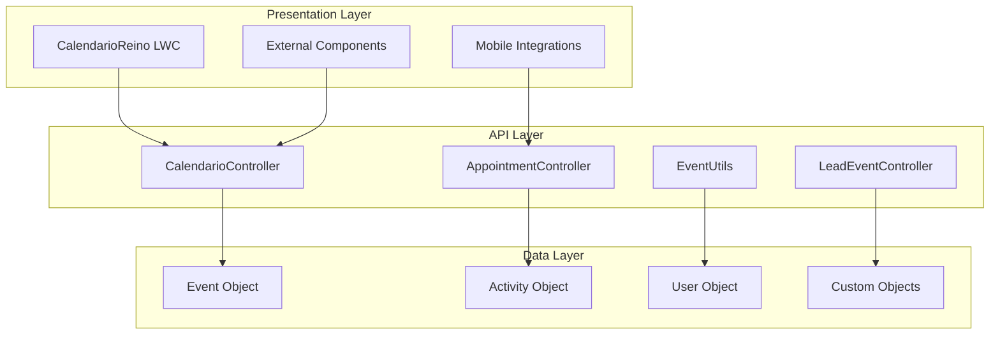

# API Documentation

## CalendarioReino API Reference

CalendarioReino exposes a comprehensive API through Apex controllers that provide programmatic access to all core system functionalities. This documentation provides detailed information about endpoints, methods, parameters, and usage examples for developers who need to integrate or extend the system.

### API Architecture



### API Principles

!!! info "API Design"
    
    **RESTful**: Follows REST principles for CRUD operations
    **Secure**: Implements FLS, CRUD, and sharing checks
    **Scalable**: Optimized for high-volume data operations
    **Consistent**: Uniform response and error patterns
    **Documented**: Comprehensive documentation with examples

## Core APIs

### Events API
Manage calendar events and meetings:

```
GET /services/data/v58.0/sobjects/Event/
POST /services/data/v58.0/sobjects/Event/
PUT /services/data/v58.0/sobjects/Event/{id}
DELETE /services/data/v58.0/sobjects/Event/{id}
```

### Rooms API
Handle room booking and management:

```
GET /services/apexrest/calendarioreino/rooms/
POST /services/apexrest/calendarioreino/rooms/book
PUT /services/apexrest/calendarioreino/rooms/{id}
DELETE /services/apexrest/calendarioreino/booking/{id}
```

### Calendar API
Manage calendar views and permissions:

```
GET /services/apexrest/calendarioreino/calendars/
POST /services/apexrest/calendarioreino/calendars/share
PUT /services/apexrest/calendarioreino/calendars/{id}/settings
```

## Integration Examples

### JavaScript (Lightning Web Component)
```javascript
import { LightningElement, wire } from 'lwc';
import getEvents from '@salesforce/apex/CalendarioReinoController.getEvents';

export class EventsList extends LightningElement {
    @wire(getEvents, { startDate: '$startDate', endDate: '$endDate' })
    events;
}
```

### Apex (Server-side)
```apex
public class CalendarioReinoController {
    @AuraEnabled(cacheable=true)
    public static List<Event> getEvents(Date startDate, Date endDate) {
        return [SELECT Id, Subject, StartDateTime, EndDateTime 
                FROM Event 
                WHERE StartDateTime >= :startDate 
                AND EndDateTime <= :endDate];
    }
}
```

### REST API (External Integration)
```python
import requests

# Get events
response = requests.get(
    'https://yourinstance.salesforce.com/services/data/v58.0/sobjects/Event/',
    headers={'Authorization': 'Bearer ' + access_token}
)
```

## Error Handling

### Error Codes
- Standard HTTP status codes
- Salesforce error responses
- Custom CalendarioReino errors
- Detailed error messages

### Rate Limiting
- API limits per organization
- Per-user limits
- Burst handling
- Quota monitoring

## Webhooks

### Event Notifications
Real-time notifications for:
- Event creation/modification
- Room booking changes
- Calendar sharing updates
- System status changes

### Configuration
- Endpoint registration
- Authentication setup
- Retry policies
- Monitoring and logging

## SDKs and Libraries

### Official SDKs
- Salesforce Platform SDK
- Lightning Web Components
- Apex libraries
- Mobile SDK integration

### Community Libraries
- JavaScript helpers
- Python integrations
- .NET connectors
- Open source tools

## Getting Started

### Prerequisites
1. Salesforce org with CalendarioReino installed
2. API access enabled
3. Appropriate permissions configured
4. Development environment setup

### First API Call
1. Authenticate with Salesforce
2. Get session token
3. Make test API call
4. Handle response

### Best Practices
- Use bulk operations when possible
- Implement proper error handling
- Cache frequently accessed data
- Monitor API usage

## Support

### Developer Resources
- API documentation
- Code samples
- Best practices guides
- Troubleshooting guides

### Community
- Developer forums
- Stack Overflow tags
- GitHub repositories
- Community contributions

### Professional Support
- Technical support tickets
- Developer consultation
- Custom integration services
- Training and workshops

---

**Note**: This is a high-level overview. Detailed API documentation with complete endpoints, parameters, and examples is available in the developer portal.

**Access Developer Portal**: [developer.calendarioreino.com](https://developer.calendarioreino.com)
