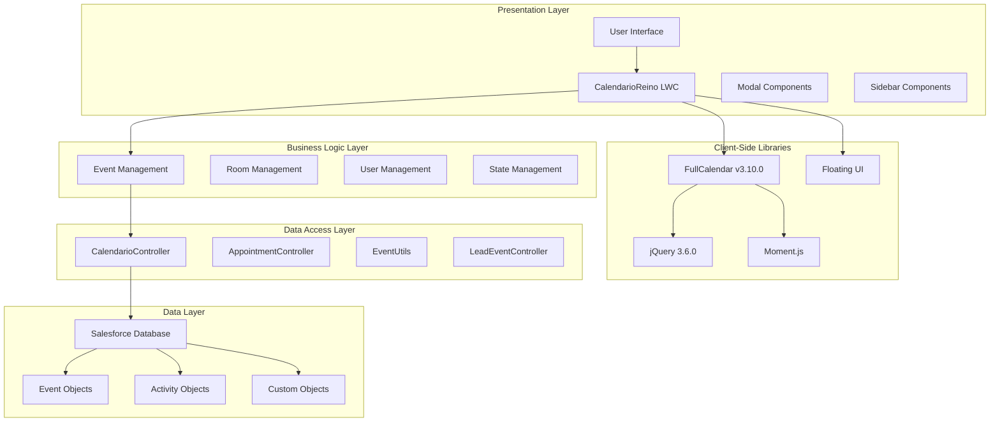
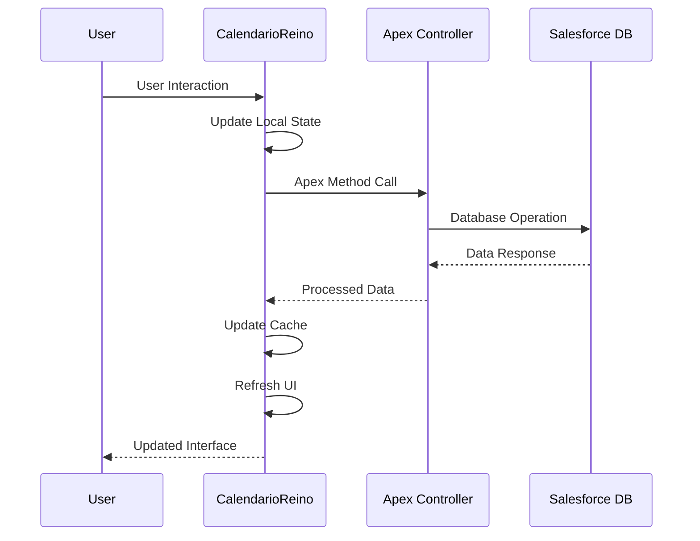

# Technical Architecture

## Architecture Overview

The CalendarioReino component follows a modern, layered architecture designed for scalability, maintainability, and performance within the Salesforce ecosystem. This Lightning Web Component (LWC) integrates seamlessly with Salesforce's platform while leveraging powerful external libraries for enhanced functionality.

### High-Level Architecture



## Component Architecture

### Core Component Structure

The CalendarioReino component is designed as a **monolithic yet well-structured** LWC with clear separation of concerns:

=== "Controller (calendarioReino.js)"

    **Primary Responsibilities:**
    
    - Presentation logic and user interactions
    - State management with reactive properties
    - Communication with Apex controllers
    - External library integration and lifecycle management
    
    **Key Features:**
    
    - Extensive use of `@track` properties for UI reactivity
    - Local event caching for performance optimization
    - Comprehensive lifecycle management (`connectedCallback`, `renderedCallback`, `disconnectedCallback`)

=== "Template (calendarioReino.html)"

    **Structure:**
    
    - Main calendar container for FullCalendar integration
    - Sidebar with collapsible sections
    - Modal overlays for event editing and creation
    - Responsive layout with Teams-inspired design
    
    **Features:**
    
    - Conditional rendering with LWC directives
    - Data binding with controller properties
    - Accessibility-compliant markup

=== "Styles (calendarioReino.css)"

    **Styling Approach:**
    
    - Custom CSS for FullCalendar theme integration
    - Responsive design patterns
    - Salesforce Lightning Design System (SLDS) compliance
    - Custom animations and transitions

### External Library Integration

#### FullCalendar v3.10.0

!!! info "Calendar Engine"
    
    **Purpose**: Core calendar rendering and interaction
    
    **Key Features**:
    
    - Multiple view types (month, week, day)
    - Drag-and-drop event management
    - Event rendering customization
    - Timezone handling with Moment.js
    
    **Integration Pattern**:
    
    ```javascript
    // Sequential dependency loading
    loadDependenciesSequentially() {
        // 1. Load CSS
        // 2. Load jQuery and jQuery UI
        // 3. Load Moment.js
        // 4. Load FullCalendar
        // 5. Load Portuguese locale
        // 6. Initialize calendar
    }
    ```

#### Floating UI

!!! tip "Dynamic Positioning"
    
    **Purpose**: Intelligent positioning for modal components
    
    **Use Cases**:
    
    - Color picker modal positioning
    - Compact appointment modal placement
    - Tooltip and popup positioning
    
    **Benefits**:
    
    - Viewport-aware positioning
    - Collision detection and adjustment
    - Smooth animations and transitions

### Data Flow Architecture



## State Management Strategy

### Reactive Properties

The component uses extensive `@track` properties for reactive state management:

=== "Event Data"

    ```javascript
    @track events = [];           // Filtered events for display
    @track allEvents = [];        // Complete event cache
    @track selectedEventId;       // Currently selected event
    @track selectedEventData;     // Selected event details
    ```

=== "UI State"

    ```javascript
    @track isLoading = false;
    @track showAppointmentEditor = false;
    @track showColorPicker = false;
    @track sidebarExpanded = true;
    ```

=== "Filter State"

    ```javascript
    @track searchTerm = '';
    @track activeFilter = 'all';
    @track selectedUserId;
    @track activeColorFilters = [];
    ```

### Caching Strategy

!!! success "Performance Optimization"
    
    **Two-Tier Caching**:
    
    1. **`allEvents`**: Complete dataset from Salesforce
    2. **`events`**: Filtered subset for FullCalendar display
    
    **Benefits**:
    
    - Client-side filtering without server calls
    - Reduced API requests and improved performance
    - Consistent data state across components

### Update Strategy

The component employs a **multi-stage update strategy** for data consistency:

```javascript
// Stage 1: Immediate cache update (100ms)
setTimeout(() => {
    this.calendar.fullCalendar('refetchEvents');
}, 100);

// Stage 2: UI auxiliary updates (300ms)
setTimeout(() => {
    this.updateColorLegendCounts();
    this.updateRoomAvailability();
}, 300);

// Stage 3: Complete re-rendering (600ms)
setTimeout(() => {
    this.calendar.fullCalendar('rerenderEvents');
    this.calendar.fullCalendar('changeView', currentView.name);
}, 600);

// Stage 4: Dependent module updates (900ms)
setTimeout(() => {
    this.forceRefreshMeetingSuggestions();
}, 900);
```

## Integration Points

### Salesforce Platform Integration

=== "Apex Controllers"

    **CalendarioController**
    
    - Primary controller for event operations
    - Methods: `getEvents`, `saveEvent`, `deleteEvent`
    - Room management: `saveEventMeetingRoom`, `getRoomAvailability`
    - Picklist values: `getStatusPicklistValues`
    
    **AppointmentController**
    
    - User search: `searchUsers`
    - Appointment creation: `createAppointment`
    
    **EventUtils**
    
    - Utility methods for event processing
    - Data transformation and validation

=== "Data Objects"

    **Standard Objects**
    
    - Event: Core meeting/appointment data
    - Activity: Extended event information
    - User: Participant and owner information
    
    **Custom Fields**
    
    - `tipoReuniao__c`: Meeting type classification
    - Custom color fields for event categorization
    - Room assignment and availability fields

### External System Integration

!!! warning "Future Enhancements"
    
    **Planned Integrations** (Phase 2):
    
    - Microsoft Teams calendar synchronization
    - Google Calendar integration
    - Outlook calendar connectivity
    - Video conferencing platform APIs

## Security Architecture

### Salesforce Security Model

=== "Field-Level Security (FLS)"

    - All Apex controllers implement FLS checks
    - User permissions validated before data access
    - Secure field access patterns throughout

=== "Sharing Rules"

    - Respect Salesforce sharing model
    - Organization-wide defaults enforcement
    - Role-based access control

=== "Data Validation"

    - Input sanitization in Apex controllers
    - Client-side validation for user experience
    - Server-side validation for security

### Component Security

!!! shield "Security Measures"
    
    - **CSP Compliance**: Content Security Policy adherence
    - **XSS Prevention**: Proper data escaping and sanitization
    - **CSRF Protection**: Salesforce platform-level protection
    - **Secure Communication**: HTTPS-only API calls

## Performance Considerations

### Optimization Strategies

=== "Client-Side Performance"

    **Event Listener Optimization**
    
    ```javascript
    optimizeEventListeners() {
        // Convert scroll events to passive listeners
        // Debounce resize events
        // Minimize DOM queries
    }
    ```
    
    **Lazy Loading**
    
    - FullCalendar lazy fetching enabled
    - Event render wait optimization
    - Progressive enhancement patterns

=== "Server-Side Performance"

    **Apex Optimization**
    
    - Bulk operations for data processing
    - Selective field queries (SOQL optimization)
    - Caching strategies for frequently accessed data
    
    **Database Optimization**
    
    - Indexed fields for common queries
    - Efficient relationship queries
    - Pagination for large datasets

### Scalability Design

!!! info "Scalability Features"
    
    - **Modular Architecture**: Easy to extend and modify
    - **Configurable Limits**: Adjustable performance parameters
    - **Caching Layers**: Multiple levels of data caching
    - **Async Processing**: Non-blocking operations where possible

---

**Architecture Status**: :material-check-circle:{ .green } Current  
**Last Review**: {{ git_revision_date_localized }}  
**Next Review**: Quarterly  
**Architect**: Technical Lead
