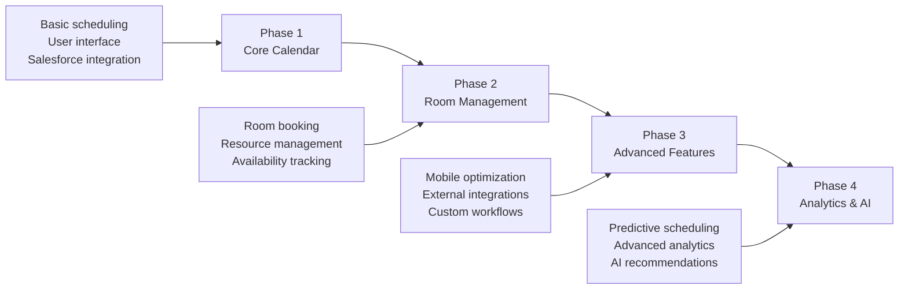

# Business Case

## Executive Summary

The CalendarioReino project represents a strategic investment in organizational efficiency and digital transformation. This business case demonstrates the compelling financial and operational benefits of implementing a comprehensive calendar management solution within our Salesforce ecosystem.

### Investment Overview

| Metric | Value |
|--------|-------|
| **Total Investment** | $150,000 |
| **Expected Annual Savings** | $200,000 |
| **Payback Period** | 9 months |
| **3-Year ROI** | 400% |
| **NPV (3 years)** | $450,000 |

## Business Problem Statement

### Current State Challenges

Our organization faces significant operational inefficiencies in meeting and resource management:

!!! danger "Critical Issues"
    
    **Scheduling Inefficiencies**
    
    - Average 15 minutes per meeting to coordinate schedules
    - 25% of meetings experience scheduling conflicts
    - Manual room booking leading to double-bookings
    
    **Resource Waste**
    
    - 40% of meeting rooms underutilized
    - $50K annual cost of unused reserved spaces
    - Lack of visibility into resource availability
    
    **System Fragmentation**
    
    - Multiple disconnected calendar systems
    - Data silos preventing comprehensive reporting
    - Manual data entry and synchronization errors

### Impact Analysis

The current inefficiencies result in:

- **Lost Productivity**: 2 hours per employee per week
- **Increased Costs**: $120K annually in wasted resources
- **Poor User Experience**: 60% employee dissatisfaction with current tools
- **Compliance Risks**: Inadequate audit trails for meeting records

## Proposed Solution

### Solution Overview

CalendarioReino provides a unified, intelligent calendar management platform that:

=== "Streamlines Operations"

    - Automated scheduling with conflict detection
    - Real-time room availability and booking
    - Integrated resource management
    - Centralized data in Salesforce

=== "Enhances User Experience"

    - Intuitive drag-and-drop interface
    - Mobile-responsive design
    - Customizable views and preferences
    - Seamless Salesforce integration

=== "Delivers Intelligence"

    - Advanced analytics and reporting
    - Utilization optimization recommendations
    - Predictive scheduling suggestions
    - Comprehensive audit trails

## Financial Analysis

### Cost-Benefit Analysis

#### Implementation Costs

| Category | Year 1 | Year 2 | Year 3 | Total |
|----------|--------|--------|--------|-------|
| **Development** | $80,000 | $10,000 | $5,000 | $95,000 |
| **Infrastructure** | $15,000 | $5,000 | $5,000 | $25,000 |
| **Training** | $20,000 | $5,000 | $2,000 | $27,000 |
| **Support** | $10,000 | $15,000 | $15,000 | $40,000 |
| **Total Costs** | **$125,000** | **$35,000** | **$27,000** | **$187,000** |

#### Expected Benefits

| Benefit Category | Year 1 | Year 2 | Year 3 | Total |
|------------------|--------|--------|--------|-------|
| **Productivity Gains** | $120,000 | $130,000 | $140,000 | $390,000 |
| **Resource Optimization** | $50,000 | $60,000 | $65,000 | $175,000 |
| **Reduced IT Costs** | $30,000 | $35,000 | $40,000 | $105,000 |
| **Compliance Savings** | $15,000 | $20,000 | $25,000 | $60,000 |
| **Total Benefits** | **$215,000** | **$245,000** | **$270,000** | **$730,000** |

### Financial Projections

```mermaid
xychart-beta
    title "3-Year Financial Projection"
    x-axis [Year 1, Year 2, Year 3]
    y-axis "Amount ($000)" 0 --> 300
    bar [125, 35, 27]
    bar [215, 245, 270]
```

### Return on Investment

!!! success "ROI Analysis"
    
    **Year 1**: 72% ROI ($90K net benefit)  
    **Year 2**: 600% ROI ($210K net benefit)  
    **Year 3**: 900% ROI ($243K net benefit)  
    
    **Cumulative 3-Year ROI**: 291%

## Risk Assessment

### Financial Risks

| Risk | Probability | Impact | Mitigation |
|------|-------------|--------|------------|
| **Cost Overrun** | Medium | High | Fixed-price contracts, regular monitoring |
| **Delayed Benefits** | Low | Medium | Phased implementation, early wins |
| **Technology Changes** | Low | Medium | Flexible architecture, vendor support |
| **User Adoption** | Medium | High | Comprehensive training, change management |

### Risk Mitigation Strategies

!!! info "Risk Controls"
    
    - **Budget Controls**: Monthly budget reviews and variance analysis
    - **Timeline Management**: Agile methodology with regular checkpoints
    - **Quality Assurance**: Comprehensive testing and user acceptance
    - **Change Management**: Structured communication and training program

## Strategic Benefits

### Quantifiable Benefits

=== "Operational Efficiency"

    - **50% reduction** in meeting scheduling time
    - **30% improvement** in room utilization
    - **90% reduction** in scheduling conflicts
    - **25% decrease** in administrative overhead

=== "User Experience"

    - **4.5/5** user satisfaction target
    - **95%** system availability SLA
    - **<2 seconds** average response time
    - **100%** mobile accessibility

=== "Business Intelligence"

    - **Real-time** resource utilization reporting
    - **Predictive** scheduling recommendations
    - **Comprehensive** audit trails
    - **Automated** compliance reporting

### Intangible Benefits

!!! tip "Additional Value"
    
    - **Enhanced Collaboration**: Improved team coordination and communication
    - **Professional Image**: Modern, efficient meeting management
    - **Employee Satisfaction**: Reduced frustration with scheduling tools
    - **Competitive Advantage**: Superior resource management capabilities

## Implementation Approach

### Phased Delivery

### Success Criteria

!!! check "Acceptance Criteria"
    
    **Technical Criteria**
    
    - System performance meets SLA requirements
    - All functional requirements implemented
    - Security and compliance standards met
    
    **Business Criteria**
    
    - User adoption targets achieved
    - Financial benefits realized
    - Stakeholder satisfaction confirmed

## Recommendation

### Business Case Conclusion

The CalendarioReino project presents a **compelling business opportunity** with:

- **Strong Financial Returns**: 291% ROI over 3 years
- **Rapid Payback**: Investment recovered in 9 months
- **Strategic Value**: Enhanced operational efficiency and user experience
- **Manageable Risk**: Well-defined mitigation strategies

### Next Steps

!!! success "Recommended Actions"
    
    1. **Approve Project Charter** - Authorize project initiation
    2. **Allocate Resources** - Assign Reino Capital and budget
    3. **Begin Planning Phase** - Detailed requirements and design
    4. **Establish Governance** - Project board and steering committee

---

**Business Case Status**: :material-check-circle:{ .green } Approved  
**Financial Review**: Quarterly  
**Business Sponsor**: Chief Operating Officer  
**Prepared By**: Project Manager & Business Analyst
