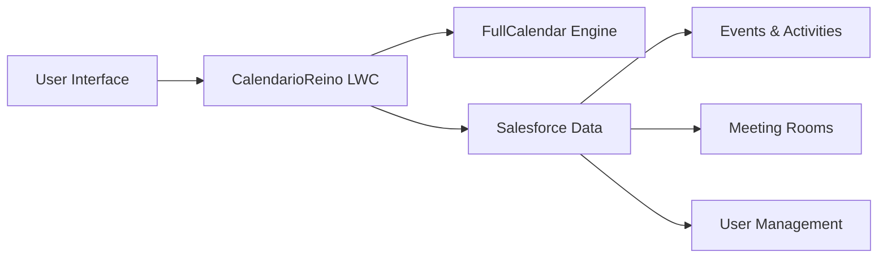
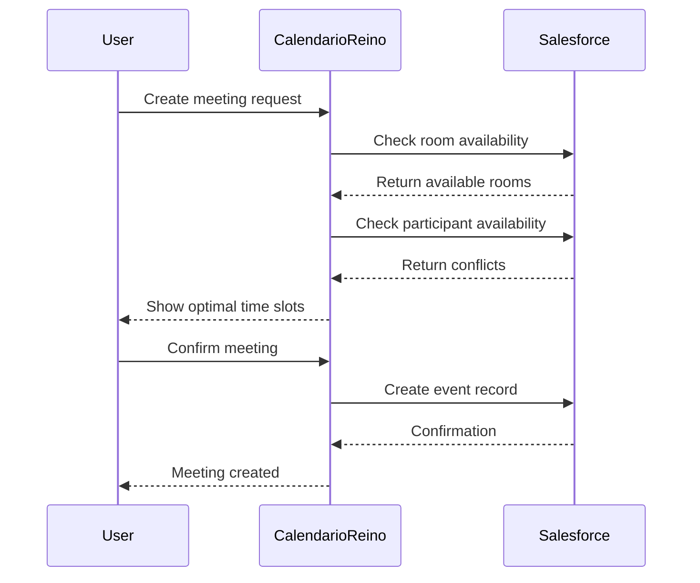

# Quick Start Guide

Get up and running with CalendarioReino in just a few minutes! This guide will walk you through the essential steps to understand and deploy the calendar component.

## Prerequisites

Before you begin, ensure you have:

!!! info "Requirements Checklist"
    
    - [x] Salesforce org with Lightning Experience enabled
    - [x] System Administrator or equivalent permissions
    - [x] Basic understanding of Salesforce Lightning components
    - [x] Access to Salesforce Developer Console or VS Code with SFDX

## 5-Minute Overview

### What is CalendarioReino?

CalendarioReino is a sophisticated **Lightning Web Component (LWC)** that transforms how your organization manages meetings, appointments, and room bookings within Salesforce.



### Key Capabilities

=== "📅 Advanced Calendar"

    - Multiple view types (month, week, day)
    - Drag-and-drop event management
    - Real-time updates and synchronization
    - Teams-inspired interface design

=== "🏢 Room Management"

    - Real-time room availability
    - Automated conflict detection
    - Visual occupancy indicators
    - Meeting type classification

=== "👥 Multi-User Support"

    - Calendar sharing across users
    - Participant management
    - Permission-based access
    - Collaborative scheduling

=== "🔧 Salesforce Integration"

    - Native Salesforce data integration
    - Custom field support
    - Security model compliance
    - Apex controller backend

## Quick Installation

### Step 1: Deploy the Component

!!! tip "Deployment Options"
    
    **Option A: Using SFDX CLI**
    ```bash
    # Clone the repository
    git clone <repository-url>
    
    # Deploy to your org
    sfdx force:source:deploy -p force-app/main/default/lwc/calendarioReino
    ```
    
    **Option B: Using Developer Console**
    
    1. Download the component files
    2. Create new Lightning Component Bundle
    3. Copy the files into the bundle
    4. Save and deploy

### Step 2: Configure Permissions

Ensure users have access to the required objects and fields:

```sql
-- Grant access to Event object
GRANT SELECT, INSERT, UPDATE, DELETE ON Event TO [User/Profile]

-- Grant access to custom fields
GRANT READ, EDIT ON Event.tipoReuniao__c TO [User/Profile]
```

### Step 3: Add to Lightning Page

1. **Edit Lightning Page**: Go to Setup → Lightning App Builder
2. **Add Component**: Drag CalendarioReino to your page
3. **Configure Properties**: Set default view, height, and permissions
4. **Save & Activate**: Deploy to your users

## First Use

### Initial Setup

When you first access CalendarioReino, you'll see:

1. **Main Calendar View**: Monthly view by default
2. **Sidebar Navigation**: Teams-style collapsible sidebar
3. **Quick Actions**: Create event, filter options
4. **Room Availability**: Real-time status indicators

### Creating Your First Event

!!! example "Step-by-Step Event Creation"
    
    **Method 1: Click on Day**
    
    1. Click on any day in the calendar
    2. Compact modal opens with pre-filled date
    3. Enter event details (subject, time, type)
    4. Click "Save" to create the event
    
    **Method 2: Drag Selection**
    
    1. Click and drag to select time range
    2. Full appointment editor opens
    3. Complete all event details
    4. Save to add to calendar

### Exploring Key Features

=== "Event Management"

    **View Events**: Click on any event to see details
    **Edit Events**: Use the three-dot menu for options
    **Color Coding**: Assign colors for easy categorization
    **Status Tracking**: Mark meetings as completed/cancelled

=== "Room Booking"

    **Check Availability**: View real-time room status
    **Book Rooms**: Select available rooms for meetings
    **Conflict Resolution**: Automatic conflict detection
    **Occupancy View**: See current and upcoming bookings

=== "User Calendars"

    **Multi-User View**: Switch between user calendars
    **Shared Calendars**: View team member schedules
    **Permission Control**: Respect Salesforce sharing rules
    **Participant Management**: Add/remove meeting participants

## Common Use Cases

### Business Meeting Scheduling



### Resource Management

!!! success "Optimization Benefits"
    
    **Before CalendarioReino**
    
    - Manual room booking via email/phone
    - Frequent double-bookings and conflicts
    - Poor visibility into resource utilization
    - Time-consuming coordination process
    
    **After CalendarioReino**
    
    - Real-time availability checking
    - Automated conflict prevention
    - Visual resource utilization dashboard
    - Streamlined booking process

## Troubleshooting

### Common Issues

=== "Component Not Loading"

    **Symptoms**: Blank screen or error messages
    
    **Solutions**:
    
    - Check browser console for JavaScript errors
    - Verify all static resources are deployed
    - Ensure user has proper permissions
    - Clear browser cache and reload

=== "Events Not Displaying"

    **Symptoms**: Calendar loads but no events show
    
    **Solutions**:
    
    - Verify user has read access to Event object
    - Check date range filters
    - Confirm events exist in the selected timeframe
    - Review sharing rules and permissions

=== "Performance Issues"

    **Symptoms**: Slow loading or unresponsive interface
    
    **Solutions**:
    
    - Limit date range for large datasets
    - Check network connectivity
    - Review browser compatibility
    - Monitor Salesforce API limits

### Getting Help

!!! question "Support Resources"
    
    **Documentation**: Comprehensive guides in this documentation site
    **Technical Support**: Contact your Salesforce administrator
    **Community**: Join the CalendarioReino user community
    **Training**: Schedule training sessions for your team

## Next Steps

### Explore Advanced Features

1. **[Technical Architecture](../architecture/index.md)**: Understand the component design
2. **[User Guide](../user-guide/index.md)**: Detailed feature documentation
3. **[API Documentation](../api/index.md)**: Integration and customization
4. **[Configuration](../user-guide/configuration.md)**: Customize for your needs

### Customize for Your Organization

!!! tip "Customization Options"
    
    **Visual Customization**
    
    - Modify CSS for branding alignment
    - Adjust color schemes and themes
    - Configure default views and layouts
    
    **Functional Customization**
    
    - Add custom fields to events
    - Integrate with external systems
    - Implement custom business logic
    - Create organization-specific workflows

### Training and Adoption

**User Training Program**:

1. **Executive Overview** (30 minutes): Business value and ROI
2. **End User Training** (1 hour): Basic functionality and features
3. **Power User Training** (2 hours): Advanced features and customization
4. **Administrator Training** (4 hours): Configuration and maintenance

**Success Metrics**:

- 90% user adoption within 6 months
- 50% reduction in scheduling time
- 30% improvement in room utilization
- 4.5/5 user satisfaction rating

---

**Quick Start Status**: :material-check-circle:{ .green } Ready to Use  
**Estimated Setup Time**: 30 minutes  
**Difficulty Level**: Beginner  
**Support**: Available 24/7
