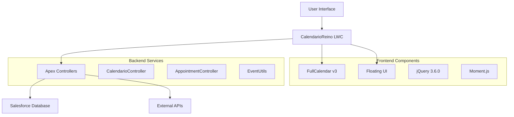

# CalendarioReino Project Documentation

-   :material-rocket-launch:{ .lg .middle } **Quick Start**

    ---

    Get CalendarioReino up and running in minutes

    [:octicons-arrow-right-24: Get Started](getting-started/quick-start.md)

-   :material-chart-line:{ .lg .middle } **Business Case**

    ---

    Understand the business value and ROI of the project

    [:octicons-arrow-right-24: Business Justification](business-case/index.md)

-   :material-cog:{ .lg .middle } **Technical Architecture**

    ---

    Deep dive into system design and components

    [:octicons-arrow-right-24: Architecture Overview](architecture/index.md)

-   :material-account-group:{ .lg .middle } **User Guide**

    ---

    Complete user manual and troubleshooting guide

    [:octicons-arrow-right-24: User Documentation](user-guide/index.md)

## Welcome to CalendarioReino Documentation

**CalendarioReino** is a sophisticated Salesforce Lightning Web Component (LWC) that provides a comprehensive calendar solution for managing meetings, appointments, and room bookings within the Salesforce ecosystem.

### Project Overview

This documentation follows **PRINCE2 methodology standards** and provides comprehensive information for:

- **Business Stakeholders**: Executive summaries, business case, and ROI analysis
- **Project Managers**: Implementation plans, risk management, and quality assurance
- **Developers**: Technical architecture, API documentation, and code examples
- **End Users**: Installation guides, user manuals, and troubleshooting

### Key Features

- **🏢 Room Management**: Comprehensive room booking and scheduling system
- **📅 Calendar Integration**: Seamless integration with Salesforce calendar features
- **👥 User Management**: Role-based access control and user permissions
- **📊 Analytics**: Detailed reporting and usage analytics
- **🔧 Customization**: Flexible configuration options to meet business needs
- **📱 Mobile Ready**: Responsive design for mobile and tablet devices

### Getting Started

Choose your path based on your role:

=== "Business Users"

    Start with the [Business Case](business-case/index.md) to understand the value proposition and [User Guide](user-guide/index.md) for day-to-day operations.

=== "Administrators"

    Begin with [Installation Guide](pt/user-guide/installation.md) and [Configuration](user-guide/configuration.md) to set up the system.

=== "Developers"

    Dive into [Technical Architecture](architecture/index.md) and [API Documentation](api/index.md) for implementation details.

=== "Project Managers"

    Review [Project Overview](project-overview/index.md) and [Risk Management](risk-management/index.md) for project planning.

### Documentation Structure

This documentation is organized into the following main sections:

- **Project Management**: Charter, objectives, and project planning
- **Business Justification**: ROI analysis and business case
- **Architecture & Design**: Technical specifications and system design
- **Implementation**: Installation, configuration, and deployment guides
- **User Documentation**: End-user guides and tutorials
- **Quality Assurance**: Testing procedures and quality standards
- **Risk Management**: Risk assessment and mitigation strategies
- **API Reference**: Developer documentation and code examples

### Support & Community

- **Technical Support**: [Support Channel](pt/user-guide/support.md)
- **Community Forum**: [Community Hub](pt/user-guide/community.md)
- **Training Resources**: [Training Materials](pt/user-guide/training.md)
- **FAQ**: [Frequently Asked Questions](pt/user-guide/faq.md)

---

!!! info "PRINCE2 Compliance"
    This documentation follows PRINCE2 project management methodology standards, ensuring comprehensive coverage of all project aspects from initiation to closure.

!!! tip "Quick Navigation"
    Use the navigation menu on the left to browse through different sections, or use the search functionality to find specific topics.

### Key Features

!!! info "Core Capabilities"
    
    - **Advanced Calendar Interface**: Built on FullCalendar v3 with rich interactivity
    - **Meeting Room Management**: Real-time availability and booking system
    - **Multi-User Support**: Calendar sharing and participant management
    - **Flexible Scheduling**: Support for online, in-person, and phone meetings
    - **Integration Ready**: Seamless Salesforce integration with Apex controllers
    - **Responsive Design**: Optimized for desktop and mobile devices

### Architecture Highlights

### Documentation Structure

This documentation is organized following PRINCE2 Project Initiation Documentation (PID) standards:

=== "Business Focus"

    - [Project Overview](project-overview/index.md) - Executive summary and objectives
    - [Business Case](business-case/index.md) - Justification and benefits analysis
    - [Quality Management](quality/index.md) - Standards and review processes
    - [Risk Management](risk-management/index.md) - Risk assessment and mitigation

=== "Technical Focus"

    - [Technical Architecture](architecture/index.md) - System design and components
    - [API Documentation](api/index.md) - Apex controllers and LWC components
    - [User Documentation](user-guide/index.md) - Installation and user guides
    - [Technical Details](technical/index.md) - Code analysis and features

=== "Project Management"

    - [Project Charter](project-overview/charter.md) - Complete project charter
    - [Project Overview](project-overview/index.md) - Complete project information
    - [Quality Management](quality/index.md) - Standards and review processes
    - [Risk Management](risk-management/index.md) - Risk assessment strategies

### Language Support

This documentation is available in multiple languages:

- **English** - Primary documentation language
- **Português** - Documentação em português brasileiro

Use the language selector in the header to switch between languages.

### Getting Started

!!! tip "New to the Project?"

    1. Start with the [Project Charter](project-overview/charter.md) for a high-level overview
    2. Review the [Business Case](business-case/index.md) to understand the value proposition
    3. Follow the [Quick Start Guide](getting-started/quick-start.md) for immediate setup
    4. Explore the [Technical Architecture](architecture/index.md) for implementation details

### Support and Contribution

!!! question "Need Help?"

    - Check the [User Guide](user-guide/index.md) for detailed information
    - Review the [Technical Documentation](technical/index.md) for technical details
    - Consult the [API Documentation](api/index.md) for integration details

---

**Last Updated**: {{ git_revision_date_localized }}  
**Version**: 1.0.0  
**Status**: :material-check-circle:{ .green } Active Development
