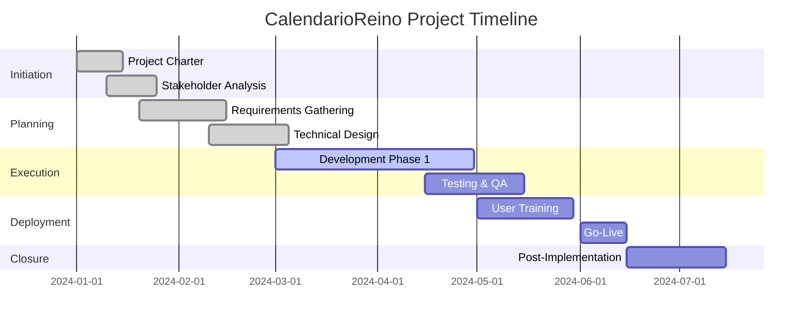

# Project Overview

## Executive Summary

The **CalendarioReino Project** represents a strategic initiative to develop and implement a comprehensive calendar management solution within the Salesforce ecosystem. This Lightning Web Component (LWC) addresses critical business needs for meeting scheduling, room management, and resource optimization.

### Project Vision

> "To deliver a world-class calendar solution that transforms how our organization manages meetings, resources, and time, while providing seamless integration with existing Salesforce infrastructure."

## Project Context

### Business Driver

The project was initiated to address several key organizational challenges:

- **Inefficient Meeting Scheduling**: Manual coordination leading to conflicts and delays
- **Resource Underutilization**: Poor visibility into meeting room availability
- **Integration Gaps**: Disconnected calendar systems causing data silos
- **User Experience Issues**: Complex interfaces reducing productivity

### Strategic Alignment

This project aligns with organizational strategic objectives:

!!! success "Strategic Benefits"
    
    - **Digital Transformation**: Modernizing workplace collaboration tools
    - **Operational Efficiency**: Reducing administrative overhead
    - **Data Integration**: Centralizing scheduling data in Salesforce
    - **User Satisfaction**: Improving employee experience

## Project Scope

### In Scope

=== "Core Features"

    - Advanced calendar interface with multiple view options
    - Real-time meeting room availability and booking
    - Multi-user calendar sharing and permissions
    - Integration with Salesforce Events and Activities
    - Mobile-responsive design for all devices
    - Comprehensive reporting and analytics

=== "Technical Components"

    - Lightning Web Component (LWC) development
    - Apex controller implementation
    - Custom object and field creation
    - Integration with external calendar systems
    - Security and permission framework
    - Performance optimization

=== "User Experience"

    - Intuitive drag-and-drop interface
    - Real-time updates and notifications
    - Customizable views and filters
    - Accessibility compliance (WCAG 2.1)
    - Multi-language support

### Out of Scope

!!! warning "Exclusions"
    
    - Integration with non-Salesforce systems (Phase 2)
    - Advanced AI-powered scheduling (Future enhancement)
    - Video conferencing platform development
    - Mobile native application development
    - Third-party calendar synchronization (Phase 2)

## Key Stakeholders

### Primary Stakeholders

| Role | Responsibility | Involvement Level |
|------|---------------|-------------------|
| **Project Executive** | Overall project accountability | High |
| **Business Users** | Requirements definition and testing | High |
| **IT Department** | Technical implementation and support | High |
| **Facilities Management** | Room and resource management | Medium |

### Secondary Stakeholders

- **Senior Management**: Strategic oversight and resource approval
- **End Users**: System adoption and feedback
- **External Vendors**: Technical support and maintenance
- **Compliance Team**: Security and regulatory requirements

## Success Metrics

### Key Performance Indicators (KPIs)

!!! info "Measurable Outcomes"
    
    **Efficiency Metrics**
    
    - 50% reduction in meeting scheduling time
    - 30% improvement in room utilization rates
    - 90% user adoption within 6 months
    
    **Quality Metrics**
    
    - 95% system availability (SLA)
    - <2 second page load times
    - 4.5/5 user satisfaction rating
    
    **Business Metrics**
    
    - 25% reduction in scheduling conflicts
    - $100K annual cost savings
    - ROI of 300% within 18 months

## Project Timeline

## Risk Overview

### High-Level Risk Assessment

| Risk Category | Probability | Impact | Mitigation Status |
|---------------|-------------|--------|-------------------|
| **Technical Complexity** | Medium | High | :material-check: Mitigated |
| **User Adoption** | Low | Medium | :material-alert: Monitoring |
| **Integration Challenges** | Medium | Medium | :material-check: Mitigated |
| **Resource Availability** | Low | High | :material-check: Mitigated |

## Next Steps

!!! tip "Immediate Actions"
    
    1. **Review Project Charter** - Ensure stakeholder alignment
    2. **Examine Business Case** - Understand value proposition
    3. **Study Technical Architecture** - Review implementation approach
    4. **Plan Implementation** - Prepare for execution phases

---

**Document Status**: :material-check-circle:{ .green } Approved  
**Last Review**: {{ git_revision_date_localized }}  
**Next Review**: Quarterly  
**Owner**: Project Manager
