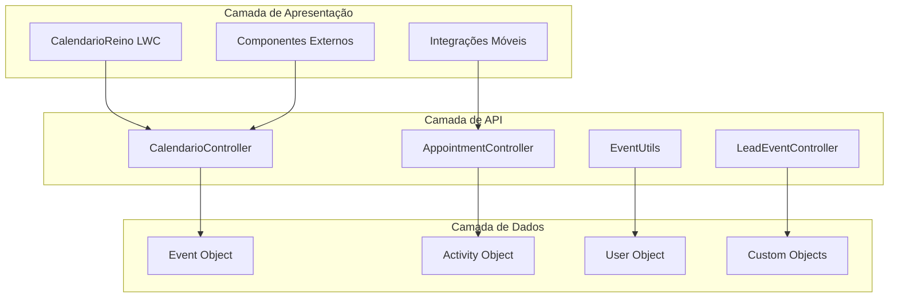

# Documentação da API

## Visão Geral da API

O CalendarioReino expõe uma API abrangente através de controladores Apex que fornecem acesso programático a todas as funcionalidades principais do sistema. Esta documentação fornece informações detalhadas sobre endpoints, métodos, parâmetros e exemplos de uso para desenvolvedores que precisam integrar ou estender o sistema.

### Arquitetura da API



### Princípios da API

!!! info "Design da API"
    
    **RESTful**: Segue princípios REST para operações CRUD
    **Segura**: Implementa FLS, CRUD e verificações de compartilhamento
    **Escalável**: Otimizada para grandes volumes de dados
    **Consistente**: Padrões uniformes de resposta e erro
    **Documentada**: Documentação abrangente com exemplos

## Controladores Apex

### CalendarioController

Controlador principal para operações de eventos e gestão de calendário.

#### Métodos Disponíveis

=== "Gestão de Eventos"

    **getEvents()**
    
    Recupera eventos baseado em critérios de filtro.
    
    ```apex
    @AuraEnabled(cacheable=true)
    public static List<EventWrapper> getEvents(
        Date startDate, 
        Date endDate, 
        String userId, 
        String filters
    )
    ```
    
    **Parâmetros:**
    - `startDate`: Data de início do período
    - `endDate`: Data de fim do período  
    - `userId`: ID do usuário (opcional)
    - `filters`: Critérios de filtro JSON (opcional)
    
    **Retorno:** Lista de objetos EventWrapper
    
    **saveEvent()**
    
    Cria ou atualiza um evento.
    
    ```apex
    @AuraEnabled
    public static String saveEvent(String eventData)
    ```
    
    **Parâmetros:**
    - `eventData`: Dados do evento em formato JSON
    
    **Retorno:** ID do evento salvo
    
    **deleteEvent()**
    
    Exclui um evento existente.
    
    ```apex
    @AuraEnabled
    public static Boolean deleteEvent(String eventId)
    ```
    
    **Parâmetros:**
    - `eventId`: ID do evento a ser excluído
    
    **Retorno:** Boolean indicando sucesso

=== "Gestão de Salas"

    **getRoomAvailability()**
    
    Verifica disponibilidade de salas para um período.
    
    ```apex
    @AuraEnabled(cacheable=true)
    public static List<RoomAvailability> getRoomAvailability(
        DateTime startTime, 
        DateTime endTime
    )
    ```
    
    **saveEventMeetingRoom()**
    
    Associa uma sala de reunião a um evento.
    
    ```apex
    @AuraEnabled
    public static Boolean saveEventMeetingRoom(
        String eventId, 
        String roomId
    )
    ```

=== "Utilitários"

    **getStatusPicklistValues()**
    
    Recupera valores de picklist para status de eventos.
    
    ```apex
    @AuraEnabled(cacheable=true)
    public static List<PicklistValue> getStatusPicklistValues()
    ```
    
    **validateEventConflicts()**
    
    Valida conflitos para um evento proposto.
    
    ```apex
    @AuraEnabled
    public static ConflictResult validateEventConflicts(
        String eventData
    )
    ```

### AppointmentController

Controlador especializado para criação rápida de compromissos.

#### Métodos Principais

=== "Gestão de Usuários"

    **searchUsers()**
    
    Busca usuários para participação em eventos.
    
    ```apex
    @AuraEnabled(cacheable=true)
    public static List<UserInfo> searchUsers(
        String searchTerm, 
        Integer limitCount
    )
    ```
    
    **Parâmetros:**
    - `searchTerm`: Termo de busca
    - `limitCount`: Número máximo de resultados
    
    **Retorno:** Lista de informações de usuários

=== "Criação de Compromissos"

    **createAppointment()**
    
    Cria um compromisso com validações simplificadas.
    
    ```apex
    @AuraEnabled
    public static String createAppointment(
        String appointmentData
    )
    ```
    
    **Parâmetros:**
    - `appointmentData`: Dados do compromisso em JSON
    
    **Retorno:** ID do compromisso criado

### EventUtils

Classe utilitária para operações auxiliares de eventos.

#### Métodos Utilitários

=== "Processamento de Dados"

    **formatEventForCalendar()**
    
    Formata dados de evento para exibição no calendário.
    
    ```apex
    public static EventWrapper formatEventForCalendar(Event evt)
    ```
    
    **validateEventData()**
    
    Valida dados de evento antes de salvar.
    
    ```apex
    public static ValidationResult validateEventData(
        String eventData
    )
    ```
    
    **calculateEventDuration()**
    
    Calcula duração de um evento.
    
    ```apex
    public static Integer calculateEventDuration(
        DateTime startTime, 
        DateTime endTime
    )
    ```

=== "Transformação de Dados"

    **convertToEventWrapper()**
    
    Converte Event para EventWrapper.
    
    ```apex
    public static EventWrapper convertToEventWrapper(Event evt)
    ```
    
    **parseEventFilters()**
    
    Analisa critérios de filtro JSON.
    
    ```apex
    public static FilterCriteria parseEventFilters(String filters)
    ```

## Modelos de Dados

### EventWrapper

Classe wrapper para dados de eventos com informações estendidas.

```apex
public class EventWrapper {
    @AuraEnabled public String id { get; set; }
    @AuraEnabled public String title { get; set; }
    @AuraEnabled public DateTime startDateTime { get; set; }
    @AuraEnabled public DateTime endDateTime { get; set; }
    @AuraEnabled public String description { get; set; }
    @AuraEnabled public String location { get; set; }
    @AuraEnabled public String ownerId { get; set; }
    @AuraEnabled public String ownerName { get; set; }
    @AuraEnabled public String type { get; set; }
    @AuraEnabled public String status { get; set; }
    @AuraEnabled public String color { get; set; }
    @AuraEnabled public Boolean isAllDay { get; set; }
    @AuraEnabled public List<String> participantIds { get; set; }
    @AuraEnabled public List<String> participantNames { get; set; }
    @AuraEnabled public String meetingRoomId { get; set; }
    @AuraEnabled public String meetingRoomName { get; set; }
    @AuraEnabled public String meetingLink { get; set; }
    @AuraEnabled public String tipoReuniao { get; set; }
}
```

### RoomAvailability

Informações de disponibilidade de salas.

```apex
public class RoomAvailability {
    @AuraEnabled public String roomId { get; set; }
    @AuraEnabled public String roomName { get; set; }
    @AuraEnabled public String location { get; set; }
    @AuraEnabled public Integer capacity { get; set; }
    @AuraEnabled public Boolean isAvailable { get; set; }
    @AuraEnabled public List<TimeSlot> occupiedSlots { get; set; }
    @AuraEnabled public String equipment { get; set; }
}
```

### UserInfo

Informações de usuário para busca e seleção.

```apex
public class UserInfo {
    @AuraEnabled public String id { get; set; }
    @AuraEnabled public String name { get; set; }
    @AuraEnabled public String email { get; set; }
    @AuraEnabled public String title { get; set; }
    @AuraEnabled public String department { get; set; }
    @AuraEnabled public String photoUrl { get; set; }
    @AuraEnabled public Boolean isActive { get; set; }
}
```

## Exemplos de Uso

### Recuperar Eventos

```javascript
// LWC - Buscar eventos para um período
import { LightningElement, wire } from 'lwc/core';
import getEvents from '@salesforce/apex/CalendarioController.getEvents';

export default class CalendarComponent extends LightningElement {
    @wire(getEvents, { 
        startDate: '$startDate', 
        endDate: '$endDate',
        userId: '$selectedUserId',
        filters: '$filterCriteria'
    })
    wiredEvents({ error, data }) {
        if (data) {
            this.events = data;
            this.updateCalendar();
        } else if (error) {
            this.handleError(error);
        }
    }
}
```

### Criar Evento

```javascript
// LWC - Criar novo evento
import saveEvent from '@salesforce/apex/CalendarioController.saveEvent';

async createEvent() {
    const eventData = {
        subject: 'Reunião de Projeto',
        startDateTime: '2025-01-15T10:00:00.000Z',
        endDateTime: '2025-01-15T11:00:00.000Z',
        description: 'Discussão sobre progresso do projeto',
        location: 'Sala de Conferência A',
        type: 'Reunião Presencial',
        participantIds: ['003XX000001', '003XX000002']
    };
    
    try {
        const eventId = await saveEvent({ 
            eventData: JSON.stringify(eventData) 
        });
        this.showToast('Sucesso', 'Evento criado com sucesso', 'success');
        this.refreshCalendar();
    } catch (error) {
        this.handleError(error);
    }
}
```

### Verificar Disponibilidade de Sala

```javascript
// LWC - Verificar disponibilidade de salas
import getRoomAvailability from '@salesforce/apex/CalendarioController.getRoomAvailability';

async checkRoomAvailability() {
    try {
        const availability = await getRoomAvailability({
            startTime: this.selectedStartTime,
            endTime: this.selectedEndTime
        });
        
        this.availableRooms = availability.filter(room => room.isAvailable);
        this.updateRoomDisplay();
    } catch (error) {
        this.handleError(error);
    }
}
```

## Tratamento de Erros

### Códigos de Erro Padrão

| Código | Descrição | Ação Recomendada |
|--------|-----------|-------------------|
| **E001** | Dados de evento inválidos | Validar formato JSON |
| **E002** | Conflito de agendamento | Sugerir horários alternativos |
| **E003** | Sala não disponível | Mostrar salas alternativas |
| **E004** | Permissões insuficientes | Verificar acesso do usuário |
| **E005** | Limite de API excedido | Implementar retry com backoff |

### Estrutura de Resposta de Erro

```apex
public class ApiResponse {
    @AuraEnabled public Boolean success { get; set; }
    @AuraEnabled public String message { get; set; }
    @AuraEnabled public String errorCode { get; set; }
    @AuraEnabled public Object data { get; set; }
    @AuraEnabled public List<String> errors { get; set; }
}
```

### Exemplo de Tratamento de Erro

```javascript
// LWC - Tratamento robusto de erros
async handleApiCall() {
    try {
        const result = await apiMethod({ params });
        if (result.success) {
            this.processSuccess(result.data);
        } else {
            this.handleApiError(result);
        }
    } catch (error) {
        this.handleSystemError(error);
    }
}

handleApiError(result) {
    switch(result.errorCode) {
        case 'E001':
            this.showValidationErrors(result.errors);
            break;
        case 'E002':
            this.showConflictDialog(result.data);
            break;
        default:
            this.showGenericError(result.message);
    }
}
```

## Segurança da API

### Controles de Acesso

!!! shield "Medidas de Segurança"
    
    **Field-Level Security (FLS)**
    
    - Todos os métodos verificam FLS antes de acessar campos
    - Campos inacessíveis são filtrados automaticamente
    - Mensagens de erro não expõem dados sensíveis
    
    **Object-Level Security (CRUD)**
    
    - Verificações CRUD implementadas em todos os controladores
    - Operações negadas retornam erros apropriados
    - Logs de auditoria para tentativas de acesso negado
    
    **Sharing Rules**
    
    - Respeita regras de compartilhamento Salesforce
    - Filtragem automática baseada em acesso do usuário
    - Suporte a compartilhamento manual e automático

### Validação de Entrada

```apex
// Exemplo de validação de entrada
public static ValidationResult validateEventData(String eventData) {
    ValidationResult result = new ValidationResult();
    
    try {
        EventWrapper event = (EventWrapper) JSON.deserialize(
            eventData, EventWrapper.class
        );
        
        // Validar campos obrigatórios
        if (String.isBlank(event.title)) {
            result.addError('Título é obrigatório');
        }
        
        // Validar datas
        if (event.startDateTime >= event.endDateTime) {
            result.addError('Data de início deve ser anterior à data de fim');
        }
        
        // Sanitizar entrada
        event.title = String.escapeSingleQuotes(event.title);
        event.description = String.escapeSingleQuotes(event.description);
        
        result.success = result.errors.isEmpty();
        result.data = event;
        
    } catch (Exception e) {
        result.addError('Formato de dados inválido: ' + e.getMessage());
    }
    
    return result;
}
```

## Performance e Otimização

### Melhores Práticas

!!! tip "Otimização de Performance"
    
    **Caching**
    
    - Use `@AuraEnabled(cacheable=true)` para métodos de leitura
    - Implemente cache local no LWC quando apropriado
    - Considere TTL para dados que mudam frequentemente
    
    **Consultas Eficientes**
    
    - Use consultas seletivas com campos específicos
    - Implemente paginação para grandes datasets
    - Use índices em campos de filtro comuns
    
    **Processamento em Lote**
    
    - Processe múltiplos registros em uma única transação
    - Use Collections.sort() em vez de ORDER BY quando possível
    - Minimize chamadas DML

### Limites da Plataforma

| Limite | Valor | Consideração |
|--------|-------|--------------|
| **Heap Size** | 6MB (síncrono) | Otimizar uso de memória |
| **CPU Time** | 10s (síncrono) | Evitar loops complexos |
| **DML Statements** | 150 | Usar bulk operations |
| **SOQL Queries** | 100 | Combinar consultas quando possível |
| **Query Rows** | 50,000 | Implementar paginação |

---

**Status da API**: :material-check-circle:{ .green } Estável  
**Versão**: 1.0.0  
**Última Atualização**: {{ git_revision_date_localized }}  
**Mantenedor**: Equipe de Desenvolvimento
