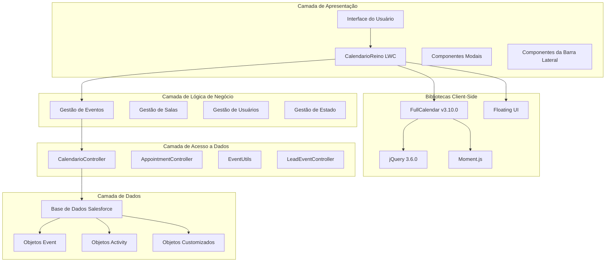
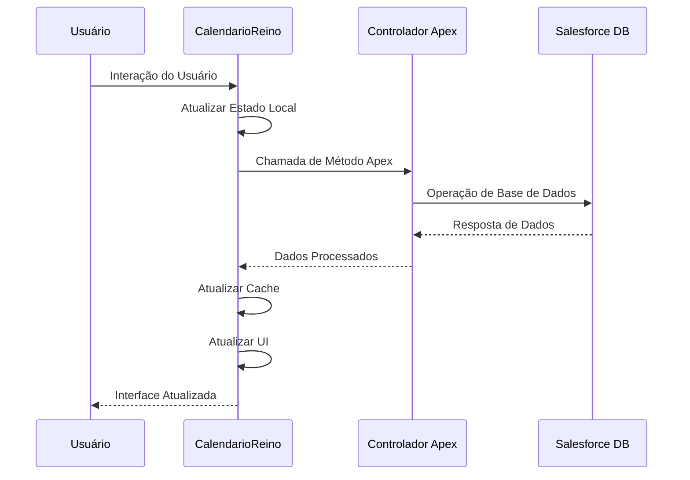

# Arquitetura Técnica

## Visão Geral da Arquitetura

O componente CalendarioReino segue uma arquitetura moderna em camadas projetada para escalabilidade, manutenibilidade e performance dentro do ecossistema Salesforce. Este Lightning Web Component (LWC) se integra perfeitamente com a plataforma Salesforce enquanto aproveita bibliotecas externas poderosas para funcionalidade aprimorada.

### Arquitetura de Alto Nível



## Arquitetura de Componentes

### Estrutura do Componente Principal

O componente CalendarioReino é projetado como um **LWC monolítico mas bem estruturado** com clara separação de responsabilidades:

=== "Controlador (calendarioReino.js)"

    **Responsabilidades Principais:**
    
    - Lógica de apresentação e interações do usuário
    - Gestão de estado com propriedades reativas
    - Comunicação com controladores Apex
    - Integração de bibliotecas externas e gestão de ciclo de vida
    
    **Recursos Principais:**
    
    - Uso extensivo de propriedades `@track` para reatividade da UI
    - Cache local de eventos para otimização de performance
    - Gestão abrangente de ciclo de vida (`connectedCallback`, `renderedCallback`, `disconnectedCallback`)

=== "Template (calendarioReino.html)"

    **Estrutura:**
    
    - Container principal do calendário para integração FullCalendar
    - Barra lateral com seções recolhíveis
    - Overlays modais para edição e criação de eventos
    - Layout responsivo com design inspirado no Teams
    
    **Recursos:**
    
    - Renderização condicional com diretivas LWC
    - Vinculação de dados com propriedades do controlador
    - Marcação compatível com acessibilidade

=== "Estilos (calendarioReino.css)"

    **Abordagem de Estilização:**
    
    - CSS customizado para integração de tema FullCalendar
    - Padrões de design responsivo
    - Conformidade com Salesforce Lightning Design System (SLDS)
    - Animações e transições customizadas

### Integração de Bibliotecas Externas

#### FullCalendar v3.10.0

!!! info "Engine de Calendário"
    
    **Propósito**: Renderização e interação principal do calendário
    
    **Recursos Principais**:
    
    - Múltiplos tipos de visualização (mês, semana, dia)
    - Gestão de eventos com arrastar e soltar
    - Customização de renderização de eventos
    - Manipulação de fuso horário com Moment.js
    
    **Padrão de Integração**:
    
    ```javascript
    // Carregamento sequencial de dependências
    loadDependenciesSequentially() {
        // 1. Carregar CSS
        // 2. Carregar jQuery e jQuery UI
        // 3. Carregar Moment.js
        // 4. Carregar FullCalendar
        // 5. Carregar locale português
        // 6. Inicializar calendário
    }
    ```

#### Floating UI

!!! tip "Posicionamento Dinâmico"
    
    **Propósito**: Posicionamento inteligente para componentes modais
    
    **Casos de Uso**:
    
    - Posicionamento do modal de seletor de cores
    - Posicionamento do modal compacto de compromissos
    - Posicionamento de tooltips e popups
    
    **Benefícios**:
    
    - Posicionamento consciente do viewport
    - Detecção e ajuste de colisões
    - Animações e transições suaves

### Arquitetura de Fluxo de Dados



## Estratégia de Gestão de Estado

### Propriedades Reativas

O componente usa propriedades `@track` extensivas para gestão de estado reativo:

=== "Dados de Eventos"

    ```javascript
    @track events = [];           // Eventos filtrados para exibição
    @track allEvents = [];        // Cache completo de eventos
    @track selectedEventId;       // Evento atualmente selecionado
    @track selectedEventData;     // Detalhes do evento selecionado
    ```

=== "Estado da UI"

    ```javascript
    @track isLoading = false;
    @track showAppointmentEditor = false;
    @track showColorPicker = false;
    @track sidebarExpanded = true;
    ```

=== "Estado de Filtros"

    ```javascript
    @track searchTerm = '';
    @track activeFilter = 'all';
    @track selectedUserId;
    @track activeColorFilters = [];
    ```

### Estratégia de Cache

!!! success "Otimização de Performance"
    
    **Cache de Duas Camadas**:
    
    1. **`allEvents`**: Dataset completo do Salesforce
    2. **`events`**: Subconjunto filtrado para exibição FullCalendar
    
    **Benefícios**:
    
    - Filtragem client-side sem chamadas ao servidor
    - Redução de requisições de API e melhoria de performance
    - Estado de dados consistente entre componentes

### Estratégia de Atualização

O componente emprega uma **estratégia de atualização multi-estágio** para consistência de dados:

```javascript
// Estágio 1: Atualização imediata de cache (100ms)
setTimeout(() => {
    this.calendar.fullCalendar('refetchEvents');
}, 100);

// Estágio 2: Atualizações auxiliares da UI (300ms)
setTimeout(() => {
    this.updateColorLegendCounts();
    this.updateRoomAvailability();
}, 300);

// Estágio 3: Re-renderização completa (600ms)
setTimeout(() => {
    this.calendar.fullCalendar('rerenderEvents');
    this.calendar.fullCalendar('changeView', currentView.name);
}, 600);

// Estágio 4: Atualizações de módulos dependentes (900ms)
setTimeout(() => {
    this.forceRefreshMeetingSuggestions();
}, 900);
```

## Pontos de Integração

### Integração com Plataforma Salesforce

=== "Controladores Apex"

    **CalendarioController**
    
    - Controlador principal para operações de eventos
    - Métodos: `getEvents`, `saveEvent`, `deleteEvent`
    - Gestão de salas: `saveEventMeetingRoom`, `getRoomAvailability`
    - Valores de picklist: `getStatusPicklistValues`
    
    **AppointmentController**
    
    - Busca de usuários: `searchUsers`
    - Criação de compromissos: `createAppointment`
    
    **EventUtils**
    
    - Métodos utilitários para processamento de eventos
    - Transformação e validação de dados

=== "Objetos de Dados"

    **Objetos Padrão**
    
    - Event: Dados principais de reunião/compromisso
    - Activity: Informações estendidas de eventos
    - User: Informações de participantes e proprietários
    
    **Campos Customizados**
    
    - `tipoReuniao__c`: Classificação de tipo de reunião
    - Campos de cores customizados para categorização de eventos
    - Campos de atribuição e disponibilidade de salas

### Integração com Sistemas Externos

!!! warning "Melhorias Futuras"
    
    **Integrações Planejadas** (Fase 2):
    
    - Sincronização de calendário Microsoft Teams
    - Integração com Google Calendar
    - Conectividade de calendário Outlook
    - APIs de plataformas de videoconferência

## Arquitetura de Segurança

### Modelo de Segurança Salesforce

=== "Segurança de Nível de Campo (FLS)"

    - Todos os controladores Apex implementam verificações FLS
    - Permissões de usuário validadas antes do acesso a dados
    - Padrões de acesso seguro a campos em todo o sistema

=== "Regras de Compartilhamento"

    - Respeita modelo de compartilhamento Salesforce
    - Aplicação de padrões organizacionais
    - Controle de acesso baseado em função

=== "Validação de Dados"

    - Sanitização de entrada em controladores Apex
    - Validação client-side para experiência do usuário
    - Validação server-side para segurança

### Segurança de Componentes

!!! shield "Medidas de Segurança"
    
    - **Conformidade CSP**: Aderência à Política de Segurança de Conteúdo
    - **Prevenção XSS**: Escape e sanitização adequados de dados
    - **Proteção CSRF**: Proteção de nível de plataforma Salesforce
    - **Comunicação Segura**: Chamadas de API somente HTTPS

## Considerações de Performance

### Estratégias de Otimização

=== "Performance Client-Side"

    **Otimização de Event Listeners**
    
    ```javascript
    optimizeEventListeners() {
        // Converter eventos de scroll para listeners passivos
        // Debounce de eventos de resize
        // Minimizar consultas DOM
    }
    ```
    
    **Lazy Loading**
    
    - Busca lazy do FullCalendar habilitada
    - Otimização de espera de renderização de eventos
    - Padrões de melhoria progressiva

=== "Performance Server-Side"

    **Otimização Apex**
    
    - Operações em lote para processamento de dados
    - Consultas de campos seletivos (otimização SOQL)
    - Estratégias de cache para dados acessados frequentemente
    
    **Otimização de Base de Dados**
    
    - Campos indexados para consultas comuns
    - Consultas de relacionamento eficientes
    - Paginação para grandes datasets

### Design de Escalabilidade

!!! info "Recursos de Escalabilidade"
    
    - **Arquitetura Modular**: Fácil de estender e modificar
    - **Limites Configuráveis**: Parâmetros de performance ajustáveis
    - **Camadas de Cache**: Múltiplos níveis de cache de dados
    - **Processamento Assíncrono**: Operações não-bloqueantes quando possível

---

**Status da Arquitetura**: :material-check-circle:{ .green } Atual  
**Última Revisão**: {{ git_revision_date_localized }}  
**Próxima Revisão**: Trimestral  
**Arquiteto**: Líder Técnico
