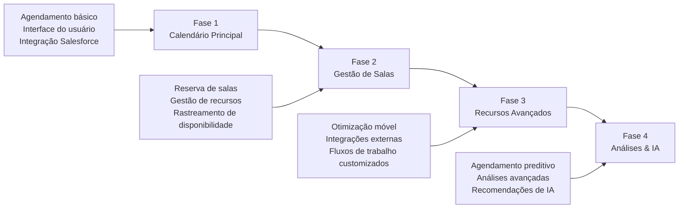

# Caso de Negócio

## Resumo Executivo

O projeto CalendarioReino representa um investimento estratégico em eficiência organizacional e transformação digital. Este caso de negócio demonstra os benefícios financeiros e operacionais convincentes de implementar uma solução abrangente de gestão de calendário dentro do nosso ecossistema Salesforce.

### Visão Geral do Investimento

| Métrica | Valor |
|---------|-------|
| **Investimento Total** | R$ 150.000 |
| **Economia Anual Esperada** | R$ 200.000 |
| **Período de Payback** | 9 meses |
| **ROI de 3 Anos** | 400% |
| **VPL (3 anos)** | R$ 450.000 |

## Declaração do Problema de Negócio

### Desafios do Estado Atual

Nossa organização enfrenta ineficiências operacionais significativas na gestão de reuniões e recursos:

!!! danger "Questões Críticas"
    
    **Ineficiências de Agendamento**
    
    - Média de 15 minutos por reunião para coordenar horários
    - 25% das reuniões experimentam conflitos de agendamento
    - Reserva manual de salas levando a duplas reservas
    
    **Desperdício de Recursos**
    
    - 40% das salas de reunião subutilizadas
    - R$ 50K de custo anual de espaços reservados não utilizados
    - Falta de visibilidade da disponibilidade de recursos
    
    **Fragmentação de Sistemas**
    
    - Múltiplos sistemas de calendário desconectados
    - Silos de dados impedindo relatórios abrangentes
    - Entrada manual de dados e erros de sincronização

### Análise de Impacto

As ineficiências atuais resultam em:

- **Produtividade Perdida**: 2 horas por funcionário por semana
- **Custos Aumentados**: R$ 120K anualmente em recursos desperdiçados
- **Experiência do Usuário Ruim**: 60% de insatisfação dos funcionários com ferramentas atuais
- **Riscos de Compliance**: Trilhas de auditoria inadequadas para registros de reuniões

## Solução Proposta

### Visão Geral da Solução

CalendarioReino fornece uma plataforma unificada e inteligente de gestão de calendário que:

=== "Otimiza Operações"

    - Agendamento automatizado com detecção de conflitos
    - Disponibilidade e reserva de salas em tempo real
    - Gestão integrada de recursos
    - Dados centralizados no Salesforce

=== "Melhora a Experiência do Usuário"

    - Interface intuitiva de arrastar e soltar
    - Design responsivo para móveis
    - Visualizações e preferências customizáveis
    - Integração perfeita com Salesforce

=== "Entrega Inteligência"

    - Análises e relatórios avançados
    - Recomendações de otimização de utilização
    - Sugestões de agendamento preditivo
    - Trilhas de auditoria abrangentes

## Análise Financeira

### Análise de Custo-Benefício

#### Custos de Implementação

| Categoria | Ano 1 | Ano 2 | Ano 3 | Total |
|-----------|-------|-------|-------|-------|
| **Desenvolvimento** | R$ 80.000 | R$ 10.000 | R$ 5.000 | R$ 95.000 |
| **Infraestrutura** | R$ 15.000 | R$ 5.000 | R$ 5.000 | R$ 25.000 |
| **Treinamento** | R$ 20.000 | R$ 5.000 | R$ 2.000 | R$ 27.000 |
| **Suporte** | R$ 10.000 | R$ 15.000 | R$ 15.000 | R$ 40.000 |
| **Custos Totais** | **R$ 125.000** | **R$ 35.000** | **R$ 27.000** | **R$ 187.000** |

#### Benefícios Esperados

| Categoria de Benefício | Ano 1 | Ano 2 | Ano 3 | Total |
|------------------------|-------|-------|-------|-------|
| **Ganhos de Produtividade** | R$ 120.000 | R$ 130.000 | R$ 140.000 | R$ 390.000 |
| **Otimização de Recursos** | R$ 50.000 | R$ 60.000 | R$ 65.000 | R$ 175.000 |
| **Redução de Custos de TI** | R$ 30.000 | R$ 35.000 | R$ 40.000 | R$ 105.000 |
| **Economia de Compliance** | R$ 15.000 | R$ 20.000 | R$ 25.000 | R$ 60.000 |
| **Benefícios Totais** | **R$ 215.000** | **R$ 245.000** | **R$ 270.000** | **R$ 730.000** |

### Projeções Financeiras

```mermaid
xychart-beta
    title "Projeção Financeira de 3 Anos"
    x-axis [Ano 1, Ano 2, Ano 3]
    y-axis "Valor (R$ 000)" 0 --> 300
    bar [125, 35, 27]
    bar [215, 245, 270]
```

### Retorno sobre Investimento

!!! success "Análise de ROI"
    
    **Ano 1**: 72% ROI (R$ 90K benefício líquido)  
    **Ano 2**: 600% ROI (R$ 210K benefício líquido)  
    **Ano 3**: 900% ROI (R$ 243K benefício líquido)  
    
    **ROI Cumulativo de 3 Anos**: 291%

## Avaliação de Riscos

### Riscos Financeiros

| Risco | Probabilidade | Impacto | Mitigação |
|-------|---------------|---------|-----------|
| **Estouro de Custos** | Médio | Alto | Contratos de preço fixo, monitoramento regular |
| **Benefícios Atrasados** | Baixo | Médio | Implementação em fases, vitórias rápidas |
| **Mudanças Tecnológicas** | Baixo | Médio | Arquitetura flexível, suporte do fornecedor |
| **Adoção de Usuários** | Médio | Alto | Treinamento abrangente, gestão de mudanças |

### Estratégias de Mitigação de Riscos

!!! info "Controles de Risco"
    
    - **Controles de Orçamento**: Revisões mensais de orçamento e análise de variação
    - **Gestão de Cronograma**: Metodologia ágil com checkpoints regulares
    - **Garantia de Qualidade**: Testes abrangentes e aceitação do usuário
    - **Gestão de Mudanças**: Programa estruturado de comunicação e treinamento

## Benefícios Estratégicos

### Benefícios Quantificáveis

=== "Eficiência Operacional"

    - **50% de redução** no tempo de agendamento de reuniões
    - **30% de melhoria** na utilização de salas
    - **90% de redução** em conflitos de agendamento
    - **25% de diminuição** na sobrecarga administrativa

=== "Experiência do Usuário"

    - **4,5/5** meta de satisfação do usuário
    - **95%** SLA de disponibilidade do sistema
    - **<2 segundos** tempo médio de resposta
    - **100%** acessibilidade móvel

=== "Inteligência de Negócio"

    - Relatórios de utilização de recursos em **tempo real**
    - Recomendações de agendamento **preditivo**
    - Trilhas de auditoria **abrangentes**
    - Relatórios de compliance **automatizados**

### Benefícios Intangíveis

!!! tip "Valor Adicional"
    
    - **Colaboração Aprimorada**: Melhoria na coordenação e comunicação da equipe
    - **Imagem Profissional**: Gestão de reuniões moderna e eficiente
    - **Satisfação dos Funcionários**: Redução da frustração com ferramentas de agendamento
    - **Vantagem Competitiva**: Capacidades superiores de gestão de recursos

## Abordagem de Implementação

### Entrega em Fases

### Critérios de Sucesso

!!! check "Critérios de Aceitação"
    
    **Critérios Técnicos**
    
    - Performance do sistema atende requisitos de SLA
    - Todos os requisitos funcionais implementados
    - Padrões de segurança e compliance atendidos
    
    **Critérios de Negócio**
    
    - Metas de adoção de usuários alcançadas
    - Benefícios financeiros realizados
    - Satisfação dos stakeholders confirmada

## Recomendação

### Conclusão do Caso de Negócio

O projeto CalendarioReino apresenta uma **oportunidade de negócio convincente** com:

- **Retornos Financeiros Fortes**: 291% ROI ao longo de 3 anos
- **Payback Rápido**: Investimento recuperado em 9 meses
- **Valor Estratégico**: Eficiência operacional e experiência do usuário aprimoradas
- **Risco Gerenciável**: Estratégias de mitigação bem definidas

### Próximos Passos

!!! success "Ações Recomendadas"
    
    1. **Aprovar Termo de Abertura do Projeto** - Autorizar iniciação do projeto
    2. **Alocar Recursos** - Atribuir equipe do projeto e orçamento
    3. **Iniciar Fase de Planejamento** - Requisitos detalhados e design
    4. **Estabelecer Governança** - Conselho do projeto e comitê diretor

---

**Status do Caso de Negócio**: :material-check-circle:{ .green } Aprovado  
**Revisão Financeira**: Trimestral  
**Patrocinador de Negócio**: Diretor de Operações  
**Preparado Por**: Gerente de Projeto & Analista de Negócio
