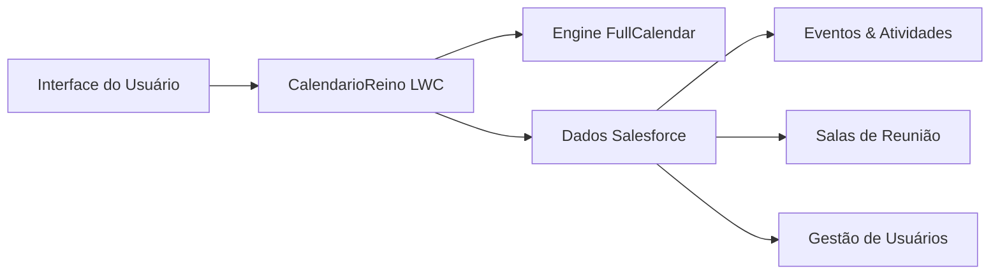
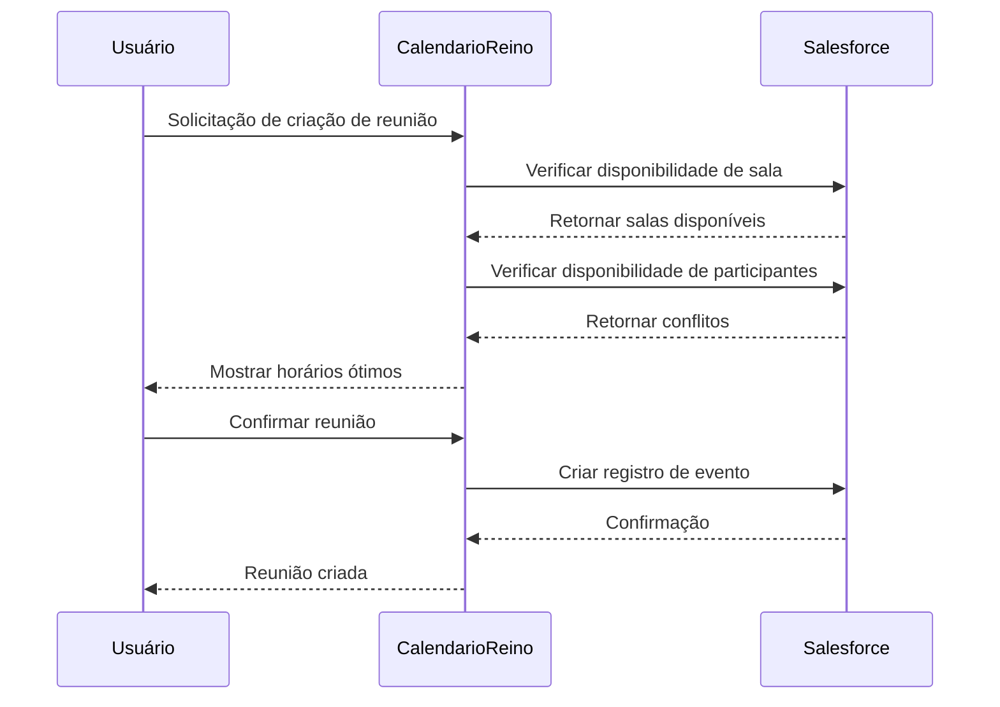

# Guia de Início Rápido

Configure e execute o CalendarioReino em apenas alguns minutos! Este guia irá orientá-lo através dos passos essenciais para entender e implementar o componente de calendário.

## Pré-requisitos

Antes de começar, certifique-se de ter:

!!! info "Lista de Verificação de Requisitos"
    
    - [x] Org Salesforce com Lightning Experience habilitado
    - [x] Permissões de Administrador do Sistema ou equivalente
    - [x] Entendimento básico de componentes Salesforce Lightning
    - [x] Acesso ao Developer Console do Salesforce ou VS Code com SFDX

## Visão Geral em 5 Minutos

### O que é o CalendarioReino?

CalendarioReino é um sofisticado **Lightning Web Component (LWC)** que transforma como sua organização gerencia reuniões, compromissos e reservas de salas dentro do Salesforce.



### Principais Capacidades

=== "📅 Calendário Avançado"

    - Múltiplos tipos de visualização (mês, semana, dia)
    - Gestão de eventos com arrastar e soltar
    - Atualizações e sincronização em tempo real
    - Design de interface inspirado no Teams

=== "🏢 Gestão de Salas"

    - Disponibilidade de salas em tempo real
    - Detecção automática de conflitos
    - Indicadores visuais de ocupação
    - Classificação de tipos de reunião

=== "👥 Suporte Multi-usuário"

    - Compartilhamento de calendário entre usuários
    - Gestão de participantes
    - Acesso baseado em permissões
    - Agendamento colaborativo

=== "🔧 Integração Salesforce"

    - Integração nativa de dados Salesforce
    - Suporte a campos customizados
    - Conformidade com modelo de segurança
    - Backend com controladores Apex

## Instalação Rápida

### Passo 1: Implementar o Componente

!!! tip "Opções de Implementação"
    
    **Opção A: Usando SFDX CLI**
    ```bash
    # Clonar o repositório
    git clone <repository-url>
    
    # Implementar na sua org
    sfdx force:source:deploy -p force-app/main/default/lwc/calendarioReino
    ```
    
    **Opção B: Usando Developer Console**
    
    1. Baixar os arquivos do componente
    2. Criar novo Lightning Component Bundle
    3. Copiar os arquivos para o bundle
    4. Salvar e implementar

### Passo 2: Configurar Permissões

Certifique-se de que os usuários tenham acesso aos objetos e campos necessários:

```sql
-- Conceder acesso ao objeto Event
GRANT SELECT, INSERT, UPDATE, DELETE ON Event TO [User/Profile]

-- Conceder acesso a campos customizados
GRANT READ, EDIT ON Event.tipoReuniao__c TO [User/Profile]
```

### Passo 3: Adicionar à Página Lightning

1. **Editar Página Lightning**: Vá para Setup → Lightning App Builder
2. **Adicionar Componente**: Arraste CalendarioReino para sua página
3. **Configurar Propriedades**: Defina visualização padrão, altura e permissões
4. **Salvar & Ativar**: Implementar para seus usuários

## Primeiro Uso

### Configuração Inicial

Quando você acessar o CalendarioReino pela primeira vez, verá:

1. **Visualização Principal do Calendário**: Visualização mensal por padrão
2. **Navegação da Barra Lateral**: Barra lateral recolhível estilo Teams
3. **Ações Rápidas**: Criar evento, opções de filtro
4. **Disponibilidade de Salas**: Indicadores de status em tempo real

### Criando Seu Primeiro Evento

!!! example "Criação de Evento Passo a Passo"
    
    **Método 1: Clicar no Dia**
    
    1. Clique em qualquer dia no calendário
    2. Modal compacto abre com data pré-preenchida
    3. Insira detalhes do evento (assunto, hora, tipo)
    4. Clique em "Salvar" para criar o evento
    
    **Método 2: Seleção por Arrastar**
    
    1. Clique e arraste para selecionar intervalo de tempo
    2. Editor completo de compromissos abre
    3. Complete todos os detalhes do evento
    4. Salvar para adicionar ao calendário

### Explorando Funcionalidades Principais

=== "Gestão de Eventos"

    **Visualizar Eventos**: Clique em qualquer evento para ver detalhes
    **Editar Eventos**: Use o menu de três pontos para opções
    **Codificação por Cores**: Atribua cores para categorização fácil
    **Rastreamento de Status**: Marque reuniões como concluídas/canceladas

=== "Reserva de Salas"

    **Verificar Disponibilidade**: Visualize status de salas em tempo real
    **Reservar Salas**: Selecione salas disponíveis para reuniões
    **Resolução de Conflitos**: Detecção automática de conflitos
    **Visualização de Ocupação**: Veja reservas atuais e futuras

=== "Calendários de Usuários"

    **Visualização Multi-usuário**: Alterne entre calendários de usuários
    **Calendários Compartilhados**: Visualize agendas de membros da equipe
    **Controle de Permissões**: Respeite regras de compartilhamento do Salesforce
    **Gestão de Participantes**: Adicione/remova participantes de reuniões

## Casos de Uso Comuns

### Agendamento de Reuniões de Negócio



### Gestão de Recursos

!!! success "Benefícios de Otimização"
    
    **Antes do CalendarioReino**
    
    - Reserva manual de salas via email/telefone
    - Frequentes conflitos e duplas reservas
    - Pouca visibilidade da utilização de recursos
    - Processo de coordenação demorado
    
    **Depois do CalendarioReino**
    
    - Verificação de disponibilidade em tempo real
    - Prevenção automática de conflitos
    - Dashboard visual de utilização de recursos
    - Processo de reserva simplificado

## Solução de Problemas

### Problemas Comuns

=== "Componente Não Carrega"

    **Sintomas**: Tela em branco ou mensagens de erro
    
    **Soluções**:
    
    - Verificar console do navegador para erros JavaScript
    - Verificar se todos os recursos estáticos foram implementados
    - Garantir que o usuário tenha permissões adequadas
    - Limpar cache do navegador e recarregar

=== "Eventos Não Aparecem"

    **Sintomas**: Calendário carrega mas nenhum evento é exibido
    
    **Soluções**:
    
    - Verificar se o usuário tem acesso de leitura ao objeto Event
    - Verificar filtros de intervalo de datas
    - Confirmar que eventos existem no período selecionado
    - Revisar regras de compartilhamento e permissões

=== "Problemas de Performance"

    **Sintomas**: Carregamento lento ou interface não responsiva
    
    **Soluções**:
    
    - Limitar intervalo de datas para grandes conjuntos de dados
    - Verificar conectividade de rede
    - Revisar compatibilidade do navegador
    - Monitorar limites de API do Salesforce

### Obtendo Ajuda

!!! question "Recursos de Suporte"
    
    **Documentação**: Guias abrangentes neste site de documentação
    **Suporte Técnico**: Entre em contato com seu administrador Salesforce
    **Comunidade**: Junte-se à comunidade de usuários CalendarioReino
    **Treinamento**: Agende sessões de treinamento para sua equipe

## Próximos Passos

### Explorar Funcionalidades Avançadas

1. **[Arquitetura Técnica](../architecture/index.md)**: Entenda o design do componente
2. **[Guia do Usuário](../user-guide/index.md)**: Documentação detalhada de funcionalidades
3. **[Documentação da API](../api/index.md)**: Integração e customização
4. **[Configuração](../user-guide/configuration.md)**: Customize para suas necessidades

### Customizar para Sua Organização

!!! tip "Opções de Customização"
    
    **Customização Visual**
    
    - Modificar CSS para alinhamento de marca
    - Ajustar esquemas de cores e temas
    - Configurar visualizações e layouts padrão
    
    **Customização Funcional**
    
    - Adicionar campos customizados a eventos
    - Integrar com sistemas externos
    - Implementar lógica de negócio customizada
    - Criar fluxos de trabalho específicos da organização

### Treinamento e Adoção

**Programa de Treinamento do Usuário**:

1. **Visão Executiva** (30 minutos): Valor comercial e ROI
2. **Treinamento do Usuário Final** (1 hora): Funcionalidade básica e recursos
3. **Treinamento de Power User** (2 horas): Recursos avançados e customização
4. **Treinamento de Administrador** (4 horas): Configuração e manutenção

**Métricas de Sucesso**:

- 90% de adoção de usuários em 6 meses
- 50% de redução no tempo de agendamento
- 30% de melhoria na utilização de salas
- Avaliação de satisfação do usuário de 4,5/5

---

**Status do Início Rápido**: :material-check-circle:{ .green } Pronto para Uso  
**Tempo Estimado de Configuração**: 30 minutos  
**Nível de Dificuldade**: Iniciante  
**Suporte**: Disponível 24/7
