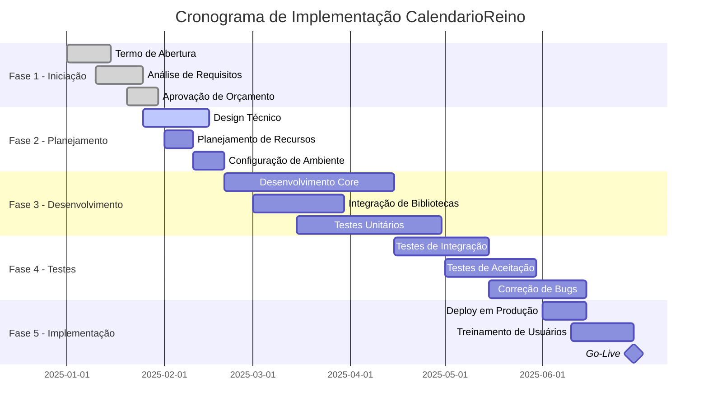
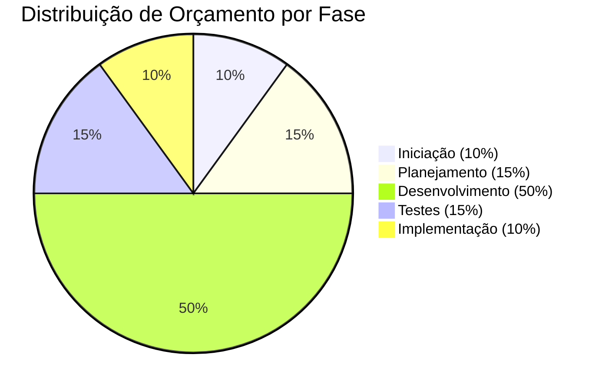
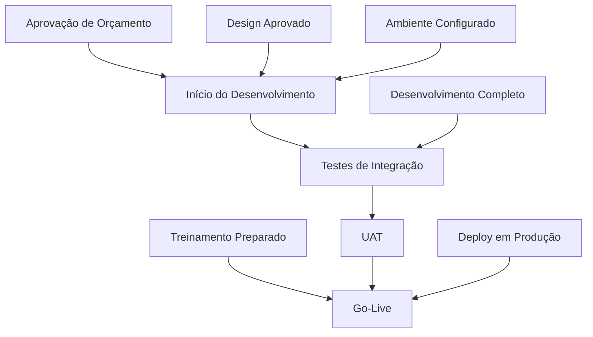

# Plano de Implementação

## Visão Geral da Implementação

O plano de implementação do CalendarioReino segue uma abordagem estruturada baseada na metodologia PRINCE2, garantindo entrega controlada e gerenciamento eficaz de riscos. O projeto é dividido em fases distintas com marcos claros e critérios de aceitação bem definidos.

### Estratégia de Implementação

## Fases do Projeto

### Fase 1: Iniciação (Janeiro 2025)

**Objetivos:**
- Estabelecer fundação sólida do projeto
- Obter aprovações necessárias
- Definir escopo e requisitos detalhados

**Entregas Principais:**

=== "Documentação de Iniciação"

    - [x] Termo de Abertura do Projeto aprovado
    - [x] Caso de Negócio detalhado
    - [x] Análise de stakeholders
    - [x] Registro inicial de riscos
    - [x] Plano de comunicação

=== "Análise de Requisitos"

    - [x] Requisitos funcionais documentados
    - [x] Requisitos não-funcionais definidos
    - [x] Casos de uso detalhados
    - [x] Critérios de aceitação
    - [x] Matriz de rastreabilidade

**Critérios de Sucesso:**
- Aprovação formal do termo de abertura
- Orçamento aprovado e recursos alocados
- Equipe do projeto formada
- Ambiente de desenvolvimento configurado

### Fase 2: Planejamento (Fevereiro 2025)

**Objetivos:**
- Criar planos detalhados de execução
- Finalizar design técnico
- Estabelecer processos de qualidade

**Entregas Principais:**

=== "Design e Arquitetura"

    - [ ] Arquitetura técnica detalhada
    - [ ] Design de interface do usuário
    - [ ] Modelo de dados
    - [ ] Especificações de integração
    - [ ] Padrões de codificação

=== "Planejamento de Projeto"

    - [ ] Cronograma detalhado
    - [ ] Plano de recursos
    - [ ] Plano de gestão de riscos
    - [ ] Plano de qualidade
    - [ ] Plano de testes

**Marcos:**
- **M1**: Design técnico aprovado (15/02/2025)
- **M2**: Ambiente de desenvolvimento pronto (20/02/2025)

### Fase 3: Desenvolvimento (Março-Abril 2025)

**Objetivos:**
- Desenvolver funcionalidades principais
- Implementar integrações
- Realizar testes unitários

**Entregas Principais:**

=== "Desenvolvimento Core"

    **Sprint 1 (Março Semana 1-2)**
    - [ ] Estrutura básica do LWC
    - [ ] Integração FullCalendar
    - [ ] Controladores Apex básicos
    - [ ] Interface de usuário inicial

    **Sprint 2 (Março Semana 3-4)**
    - [ ] Gestão de eventos (CRUD)
    - [ ] Sistema de filtros
    - [ ] Barra lateral funcional
    - [ ] Modais de criação/edição

    **Sprint 3 (Abril Semana 1-2)**
    - [ ] Gestão de salas de reunião
    - [ ] Sistema de cores
    - [ ] Validações e tratamento de erros
    - [ ] Otimizações de performance

    **Sprint 4 (Abril Semana 3-4)**
    - [ ] Recursos avançados
    - [ ] Integração Floating UI
    - [ ] Responsividade móvel
    - [ ] Polimento da interface

=== "Qualidade e Testes"

    - [ ] Testes unitários (>95% cobertura)
    - [ ] Revisões de código
    - [ ] Análise de segurança
    - [ ] Testes de performance

**Marcos:**
- **M3**: MVP funcional (31/03/2025)
- **M4**: Desenvolvimento completo (30/04/2025)

### Fase 4: Testes e Validação (Maio 2025)

**Objetivos:**
- Validar funcionalidades com usuários
- Garantir qualidade e performance
- Preparar para produção

**Entregas Principais:**

=== "Testes Abrangentes"

    **Testes de Sistema**
    - [ ] Testes funcionais completos
    - [ ] Testes de integração
    - [ ] Testes de performance
    - [ ] Testes de segurança
    - [ ] Testes de compatibilidade

    **Testes de Aceitação**
    - [ ] UAT com usuários-chave
    - [ ] Validação de requisitos
    - [ ] Testes de usabilidade
    - [ ] Aprovação de stakeholders

=== "Preparação para Produção"

    - [ ] Documentação de usuário
    - [ ] Materiais de treinamento
    - [ ] Procedimentos de deploy
    - [ ] Plano de rollback
    - [ ] Monitoramento configurado

**Marcos:**
- **M5**: Testes de sistema concluídos (15/05/2025)
- **M6**: UAT aprovado (30/05/2025)

### Fase 5: Implementação e Go-Live (Junho 2025)

**Objetivos:**
- Implementar em produção
- Treinar usuários
- Garantir adoção bem-sucedida

**Entregas Principais:**

=== "Deploy e Ativação"

    **Implementação Técnica**
    - [ ] Deploy em produção
    - [ ] Configuração de permissões
    - [ ] Migração de dados
    - [ ] Testes de fumaça
    - [ ] Ativação para usuários

    **Habilitação de Usuários**
    - [ ] Treinamento de administradores
    - [ ] Treinamento de usuários finais
    - [ ] Documentação distribuída
    - [ ] Suporte inicial intensivo

=== "Estabilização"

    - [ ] Monitoramento 24/7
    - [ ] Correção de problemas críticos
    - [ ] Coleta de feedback
    - [ ] Otimizações pós-go-live

**Marcos:**
- **M7**: Sistema em produção (15/06/2025)
- **M8**: Go-Live oficial (30/06/2025)

## Gestão de Recursos

### Equipe do Projeto

| Papel | Recurso | Alocação | Período |
|-------|---------|----------|---------|
| **Gerente de Projeto** | [Nome] | 100% | Jan-Jul 2025 |
| **Arquiteto Técnico** | [Nome] | 80% | Jan-Jun 2025 |
| **Desenvolvedor Sênior** | [Nome] | 100% | Fev-Mai 2025 |
| **Desenvolvedor Júnior** | [Nome] | 100% | Mar-Mai 2025 |
| **Analista de QA** | [Nome] | 60% | Mar-Jun 2025 |
| **Designer UX/UI** | [Nome] | 40% | Fev-Mar 2025 |
| **Analista de Negócio** | [Nome] | 50% | Jan-Abr 2025 |

### Orçamento por Fase

| Fase | Orçamento | Principais Custos |
|------|-----------|-------------------|
| **Iniciação** | R$ 15.000 | Análise, documentação |
| **Planejamento** | R$ 22.500 | Design, arquitetura |
| **Desenvolvimento** | R$ 75.000 | Desenvolvimento, testes unitários |
| **Testes** | R$ 22.500 | QA, UAT, correções |
| **Implementação** | R$ 15.000 | Deploy, treinamento |
| **Total** | **R$ 150.000** | |

## Gestão de Dependências

### Dependências Críticas

!!! warning "Dependências de Alto Risco"
    
    **Dependências Técnicas**
    
    - Estabilidade da plataforma Salesforce
    - Disponibilidade de bibliotecas FullCalendar
    - Capacidade de infraestrutura
    - Compatibilidade de navegadores
    
    **Dependências de Negócio**
    
    - Disponibilidade de stakeholders para decisões
    - Participação de usuários em testes
    - Aprovações de mudanças de processo
    - Recursos de treinamento

### Matriz de Dependências

## Estratégia de Riscos

### Riscos de Implementação

| Risco | Impacto | Probabilidade | Mitigação |
|-------|---------|---------------|-----------|
| **Atraso no desenvolvimento** | Alto | Médio | Buffer de 20% no cronograma |
| **Problemas de integração** | Alto | Baixo | Testes de integração precoces |
| **Resistência de usuários** | Médio | Médio | Programa robusto de gestão de mudanças |
| **Problemas de performance** | Médio | Baixo | Testes de carga regulares |

### Planos de Contingência

=== "Atraso no Cronograma"

    **Ações Imediatas**
    - Reavaliação de escopo
    - Recursos adicionais
    - Trabalho em paralelo
    - Redução de recursos não-críticos

=== "Problemas Técnicos"

    **Estratégias de Mitigação**
    - Suporte técnico especializado
    - Soluções alternativas
    - Rollback para versão anterior
    - Implementação em fases

## Critérios de Sucesso

### Critérios de Aceitação por Fase

!!! check "Critérios de Go/No-Go"
    
    **Fase 1 → Fase 2**
    - [ ] Termo de abertura aprovado
    - [ ] Orçamento confirmado
    - [ ] Equipe alocada
    - [ ] Requisitos documentados
    
    **Fase 2 → Fase 3**
    - [ ] Design técnico aprovado
    - [ ] Ambiente de desenvolvimento pronto
    - [ ] Planos de projeto finalizados
    - [ ] Riscos identificados e mitigados
    
    **Fase 3 → Fase 4**
    - [ ] Funcionalidades principais implementadas
    - [ ] Testes unitários passando (>95%)
    - [ ] Revisões de código aprovadas
    - [ ] Performance dentro dos requisitos
    
    **Fase 4 → Fase 5**
    - [ ] Todos os testes passando
    - [ ] UAT aprovado por stakeholders
    - [ ] Documentação completa
    - [ ] Treinamento preparado
    
    **Go-Live**
    - [ ] Deploy em produção bem-sucedido
    - [ ] Testes de fumaça aprovados
    - [ ] Usuários treinados
    - [ ] Suporte ativo disponível

### Métricas de Sucesso

| Métrica | Meta | Medição |
|---------|------|---------|
| **Cronograma** | Entrega até 30/06/2025 | Marcos atingidos |
| **Orçamento** | Dentro de R$ 150.000 | Gastos vs orçamento |
| **Qualidade** | Zero defeitos críticos | Relatórios de QA |
| **Adoção** | 90% em 6 meses | Analytics de uso |
| **Satisfação** | 4,5/5 avaliação | Pesquisas de usuário |

---

**Status da Implementação**: :material-check-circle:{ .green } Em Andamento  
**Fase Atual**: Planejamento  
**Próximo Marco**: Design técnico aprovado (15/02/2025)  
**Gerente de Projeto**: [Nome do Gerente]
