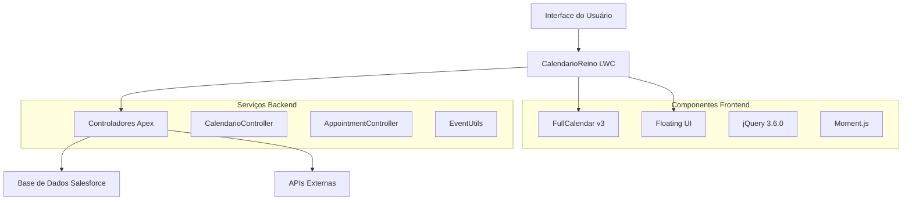

# Documentação do calendário da Reino Capital

-   :material-rocket-launch:{ .lg .middle } **Início Rápido**

    ---

    Configure e execute o CalendarioReino em minutos

    [:octicons-arrow-right-24: Começar](getting-started/quick-start.md)

-   :material-chart-line:{ .lg .middle } **Caso de Negócio**

    ---

    Entenda o valor comercial e ROI do projeto

    [:octicons-arrow-right-24: Justificativa Comercial](business-case/index.md)

-   :material-cog:{ .lg .middle } **Arquitetura Técnica**

    ---

    Mergulhe fundo no design do sistema e componentes

    [:octicons-arrow-right-24: Visão da Arquitetura](architecture/index.md)

-   :material-account-group:{ .lg .middle } **Guia do Usuário**

    ---

    Manual completo do usuário e guia de solução de problemas

    [:octicons-arrow-right-24: Documentação do Usuário](user-guide/index.md)

## Bem-vindo à Documentação do CalendarioReino

**CalendarioReino** é um sofisticado Lightning Web Component (LWC) do Salesforce que fornece uma solução abrangente de calendário para gerenciar reuniões, compromissos e reservas de salas dentro do ecossistema Salesforce.

### Visão Geral do Projeto

Esta documentação segue os **padrões da metodologia PRINCE2** e fornece informações abrangentes para:

- **Stakeholders de Negócio**: Resumos executivos, caso de negócio e análise de ROI
- **Gerentes de Projeto**: Planos de implementação, gestão de riscos e garantia de qualidade
- **Desenvolvedores**: Arquitetura técnica, documentação de API e exemplos de código
- **Usuários Finais**: Guias de instalação, manuais do usuário e solução de problemas

### Principais Funcionalidades

!!! info "Capacidades Principais"
    
    - **Interface de Calendário Avançada**: Construída no FullCalendar v3 com rica interatividade
    - **Gestão de Salas de Reunião**: Sistema de disponibilidade e reserva em tempo real
    - **Suporte Multi-usuário**: Compartilhamento de calendário e gestão de participantes
    - **Agendamento Flexível**: Suporte para reuniões online, presenciais e telefônicas
    - **Integração Pronta**: Integração perfeita com Salesforce via controladores Apex
    - **Design Responsivo**: Otimizado para dispositivos desktop e móveis

### Destaques da Arquitetura

### Estrutura da Documentação

Esta documentação está organizada seguindo os padrões da Documentação de Iniciação de Projeto (PID) do PRINCE2:

=== "Foco Comercial"

    - [Visão Geral do Projeto](project-overview/index.md) - Resumo executivo e objetivos
    - [Caso de Negócio](business-case/index.md) - Justificativa e análise de benefícios
    - [Plano de Implementação](implementation/index.md) - Fases e marcos
    - [Gestão de Riscos](risk-management/index.md) - Avaliação e mitigação de riscos

=== "Foco Técnico"

    - [Arquitetura Técnica](architecture/index.md) - Design do sistema e componentes
    - [Documentação da API](api/index.md) - Controladores Apex e componentes LWC
    - [Documentação do Usuário](user-guide/index.md) - Instalação e guias do usuário
    - [Detalhes Técnicos](technical/index.md) - Análise de código e funcionalidades

=== "Gestão de Projeto"

    - [Gestão de Qualidade](quality/index.md) - Padrões e processos de revisão
    - [Visão Geral do Projeto](project-overview/index.md) - Informações completas do projeto
    - [Plano de Implementação](implementation/index.md) - Fases e marcos do projeto
    - [Gestão de Riscos](risk-management/index.md) - Estratégias de avaliação de riscos

### Suporte a Idiomas

Esta documentação está disponível em múltiplos idiomas:

- **Português** - Documentação principal em português brasileiro
- **English** - Primary documentation in English

Use o seletor de idioma no cabeçalho para alternar entre os idiomas.

### Começando

!!! tip "Novo no Projeto?"

    1. Comece com o [Termo de Abertura do Projeto](project-overview/charter.md) para uma visão geral de alto nível
    2. Revise o [Caso de Negócio](business-case/index.md) para entender a proposta de valor
    3. Siga o [Guia de Início Rápido](getting-started/quick-start.md) para configuração imediata
    4. Explore a [Arquitetura Técnica](architecture/index.md) para detalhes de implementação

### Suporte e Contribuição

!!! question "Precisa de Ajuda?"

    - Consulte o [Guia do Usuário](user-guide/index.md) para informações detalhadas
    - Revise a [Documentação Técnica](technical/index.md) para detalhes técnicos
    - Consulte a [Documentação da API](api/index.md) para detalhes de integração

---

**Última Atualização**: {{ git_revision_date_localized }}  
**Versão**: 1.0.0  
**Status**: :material-check-circle:{ .green } Desenvolvimento Ativo
