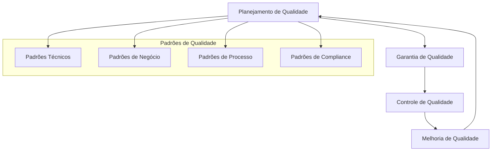
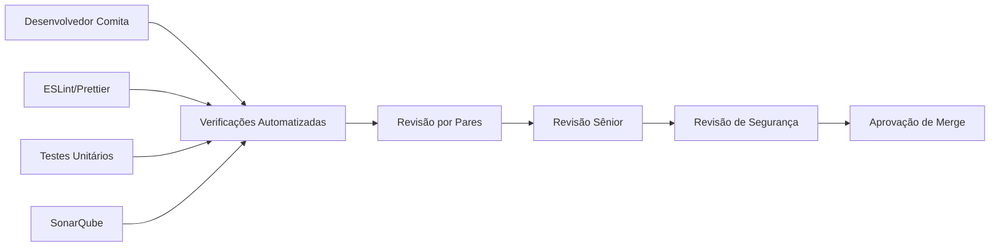
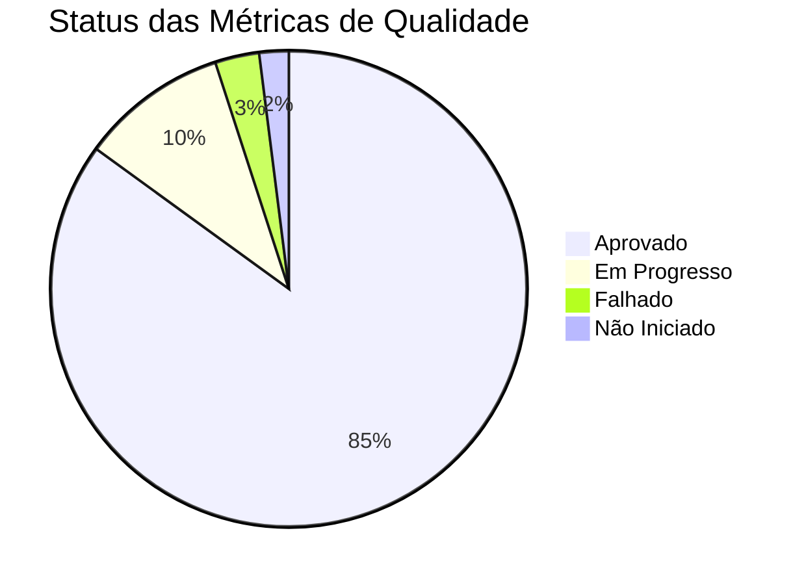
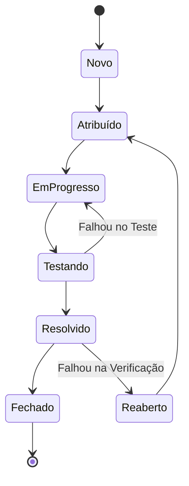

# Gestão de Qualidade

## Abordagem de Gestão de Qualidade

Seguindo as práticas de gestão de qualidade PRINCE2, este projeto implementa uma estrutura abrangente de qualidade para garantir que as entregas atendam aos padrões definidos e às expectativas dos stakeholders. Nossa abordagem enfatiza prevenção sobre detecção e melhoria contínua durante todo o ciclo de vida do projeto.

### Estrutura de Qualidade

### Objetivos de Qualidade

!!! success "Metas de Qualidade"
    
    **Excelência Técnica**
    
    - 99,5% de disponibilidade do sistema
    - <2 segundos de tempo médio de resposta
    - Zero vulnerabilidades críticas de segurança
    - 95% de cobertura de código em testes unitários
    
    **Experiência do Usuário**
    
    - Avaliação de satisfação do usuário de 4,5/5
    - <3 cliques para tarefas comuns
    - Conformidade com acessibilidade WCAG 2.1 AA
    - Responsividade móvel em todos os dispositivos
    
    **Valor de Negócio**
    
    - 100% dos requisitos funcionais atendidos
    - 90% de adoção de usuários em 6 meses
    - Metas de ROI alcançadas em 18 meses
    - Zero incidentes de perda de dados

## Padrões de Qualidade

### Padrões Técnicos

=== "Qualidade de Código"

    **Padrões Salesforce**
    
    - Melhores práticas de Lightning Web Component
    - Padrões e convenções de codificação Apex
    - Requisitos de revisão de segurança (FLS, CRUD, Compartilhamento)
    - Diretrizes de otimização de performance
    
    **Padrões JavaScript**
    
    - Configuração ESLint para qualidade de código
    - Prettier para formatação consistente
    - Requisitos de documentação JSDoc
    - Uso de sintaxe ES6+ moderna
    
    **Padrões CSS**
    
    - Conformidade com Salesforce Lightning Design System (SLDS)
    - Metodologia BEM para nomenclatura de classes
    - Princípios de design responsivo
    - Compatibilidade cross-browser

=== "Padrões de Arquitetura"

    **Design de Componentes**
    
    - Princípio de Responsabilidade Única
    - Baixo acoplamento, alta coesão
    - Padrões de componentes reutilizáveis
    - Clara separação de responsabilidades
    
    **Padrões de Integração**
    
    - Princípios de design de API RESTful
    - Padrões de tratamento de erros e logging
    - Validação e sanitização de dados
    - Protocolos de comunicação segura

=== "Padrões de Performance"

    **Requisitos de Tempo de Resposta**
    
    | Operação | Meta | Máximo |
    |----------|------|--------|
    | Carregamento de Página | <2 segundos | 3 segundos |
    | Criação de Evento | <1 segundo | 2 segundos |
    | Navegação de Calendário | <0,5 segundos | 1 segundo |
    | Resultados de Busca | <1 segundo | 2 segundos |
    
    **Requisitos de Escalabilidade**
    
    - Suporte a 1000+ usuários simultâneos
    - Manipulação de 50.000+ eventos por usuário
    - SLA de 99,5% de uptime
    - Degradação graciosa sob carga

### Padrões de Negócio

=== "Requisitos Funcionais"

    **Funcionalidade Principal**
    
    - ✅ Gestão de visualização de calendário (mês, semana, dia)
    - ✅ Criação, edição e exclusão de eventos
    - ✅ Reserva e gestão de salas de reunião
    - ✅ Compartilhamento de calendário multi-usuário
    - ✅ Verificação de disponibilidade em tempo real
    - ✅ Filtragem e busca avançadas
    
    **Requisitos de Experiência do Usuário**
    
    - Design de interface intuitivo
    - Padrões de interação consistentes
    - Ajuda e orientação contextual
    - Prevenção e recuperação de erros
    - Acessibilidade para todos os usuários

=== "Padrões de Processo de Negócio"

    **Gestão de Reuniões**
    
    - Detecção automática de conflitos
    - Validação de disponibilidade de recursos
    - Sistema de notificação de participantes
    - Rastreamento de resultados de reuniões
    
    **Gestão de Dados**
    
    - Validação de integridade de dados
    - Manutenção de trilha de auditoria
    - Procedimentos de backup e recuperação
    - Privacidade e confidencialidade

### Padrões de Compliance

!!! shield "Conformidade Regulatória"
    
    **Proteção de Dados**
    
    - Conformidade LGPD para usuários brasileiros
    - Princípios de minimização de dados
    - Implementação do direito ao esquecimento
    - Gestão de consentimento
    
    **Padrões de Segurança**
    
    - Prevenção de vulnerabilidades OWASP Top 10
    - Melhores práticas de segurança Salesforce
    - Avaliações regulares de segurança
    - Procedimentos de resposta a incidentes
    
    **Padrões de Acessibilidade**
    
    - Conformidade WCAG 2.1 AA
    - Compatibilidade com leitores de tela
    - Suporte à navegação por teclado
    - Requisitos de contraste de cores

## Processo de Garantia de Qualidade

### Planejamento de Qualidade

#### Definição de Critérios de Qualidade

Para cada entrega, definimos critérios específicos de qualidade:

=== "Entregas de Código"

    **Critérios de Aceitação**
    
    - Todos os requisitos funcionais implementados
    - Cobertura de testes unitários >95%
    - Aprovação de revisão de código por desenvolvedor sênior
    - Revisão de segurança aprovada
    - Benchmarks de performance atendidos
    
    **Medidas de Qualidade**
    
    - Complexidade ciclomática <10
    - Nenhuma violação crítica do SonarQube
    - Cobertura de documentação >90%
    - Zero vulnerabilidades de segurança conhecidas

=== "Entregas de Documentação"

    **Critérios de Aceitação**
    
    - Cobertura completa de todos os recursos
    - Estilo de escrita claro e conciso
    - Informações técnicas precisas
    - Formatação e estrutura adequadas
    - Aprovação de revisão de stakeholders
    
    **Medidas de Qualidade**
    
    - Pontuação de legibilidade >70
    - Zero links quebrados ou referências
    - Uso consistente de terminologia
    - Screenshots e exemplos atualizados

### Atividades de Controle de Qualidade

#### Processo de Revisão de Código

**Checklist de Revisão**:

!!! check "Critérios de Revisão de Código"
    
    - [ ] Requisitos funcionais atendidos
    - [ ] Código segue padrões estabelecidos
    - [ ] Tratamento adequado de erros implementado
    - [ ] Melhores práticas de segurança seguidas
    - [ ] Considerações de performance abordadas
    - [ ] Testes unitários escritos e passando
    - [ ] Documentação atualizada
    - [ ] Nenhum code smell ou anti-padrão

#### Estratégia de Testes

=== "Testes Unitários"

    **Requisitos de Cobertura**
    
    - Classes Apex: >95% de cobertura
    - Funções JavaScript: >90% de cobertura
    - Testes de caminho crítico: 100% de cobertura
    - Testes de casos extremos: Abrangente
    
    **Framework de Testes**
    
    - Testes nativos Salesforce para Apex
    - Jest para testes unitários JavaScript
    - Frameworks mock para dependências externas
    - Execução automatizada de testes em CI/CD

=== "Testes de Integração"

    **Cenários de Teste**
    
    - Integração com plataforma Salesforce
    - Compatibilidade de bibliotecas externas
    - Funcionalidade cross-browser
    - Responsividade de dispositivos móveis
    - Validação de endpoints de API
    
    **Ambiente de Teste**
    
    - Sandbox dedicado para testes
    - Volumes de dados similares à produção
    - Múltiplos perfis de usuário e permissões
    - Várias combinações de dispositivos e navegadores

=== "Testes de Aceitação do Usuário"

    **Processo UAT**
    
    1. **Criação de Plano de Teste**: Cenários detalhados baseados em user stories
    2. **Configuração de Ambiente de Teste**: Ambiente similar à produção com dados reais
    3. **Treinamento de Usuários**: Breve treinamento sobre novos recursos
    4. **Execução de Testes**: Usuários executam cenários do mundo real
    5. **Coleta de Feedback**: Feedback estruturado e relatório de problemas
    6. **Resolução de Problemas**: Correções de bugs e melhorias de usabilidade
    7. **Sign-off**: Aceitação formal por stakeholders de negócio

### Métricas e Monitoramento de Qualidade

#### Indicadores-Chave de Qualidade (KQIs)

| Métrica | Meta | Atual | Tendência | Ação Necessária |
|---------|------|-------|-----------|-----------------|
| **Cobertura de Código** | >95% | 97,2% | ↗️ | Nenhuma |
| **Densidade de Bugs** | <0,5/KLOC | 0,3/KLOC | ↘️ | Nenhuma |
| **Satisfação do Usuário** | >4,5/5 | 4,7/5 | ↗️ | Nenhuma |
| **Performance** | <2s carregamento | 1,8s média | ↗️ | Nenhuma |
| **Disponibilidade** | >99,5% | 99,8% | ↗️ | Nenhuma |

#### Dashboard de Qualidade

### Gestão de Defeitos

#### Classificação de Defeitos

=== "Níveis de Severidade"

    **Crítico (P1)**
    
    - Crashes do sistema ou perda de dados
    - Vulnerabilidades de segurança
    - Falha completa de funcionalidade
    - **SLA**: 4 horas resposta, 24 horas resolução
    
    **Alto (P2)**
    
    - Funcionalidade principal prejudicada
    - Performance significativamente degradada
    - Workaround disponível mas difícil
    - **SLA**: 8 horas resposta, 72 horas resolução
    
    **Médio (P3)**
    
    - Problemas menores de funcionalidade
    - Problemas cosméticos afetando usabilidade
    - Workaround fácil disponível
    - **SLA**: 24 horas resposta, 1 semana resolução
    
    **Baixo (P4)**
    
    - Solicitações de melhoria
    - Problemas de documentação
    - Problemas cosméticos menores
    - **SLA**: 1 semana resposta, próximo release

#### Ciclo de Vida de Defeitos

## Melhoria de Qualidade

### Processo de Melhoria Contínua

!!! tip "Ciclo de Melhoria"
    
    **Planejar**: Identificar oportunidades de melhoria
    **Fazer**: Implementar melhorias em pequena escala
    **Verificar**: Medir resultados e efetividade
    **Agir**: Padronizar melhorias bem-sucedidas

### Integração de Lições Aprendidas

=== "Retrospectivas de Qualidade"

    **Revisões Mensais**
    
    - Análise de métricas de qualidade
    - Avaliação de efetividade de processos
    - Coleta de feedback da equipe
    - Planejamento de ações de melhoria
    
    **Avaliações Trimestrais**
    
    - Análise de tendências de qualidade
    - Comparações de benchmark
    - Oportunidades de otimização de processos
    - Identificação de necessidades de treinamento

=== "Documentação de Melhores Práticas"

    **Gestão de Conhecimento**
    
    - Documentação de padrões de qualidade
    - Repositório de melhores práticas
    - Base de dados de lições aprendidas
    - Manutenção de materiais de treinamento

### Treinamento e Competência em Qualidade

#### Programa de Treinamento

!!! info "Matriz de Treinamento de Qualidade"
    
    **Treinamento Técnico**
    
    - Melhores práticas de desenvolvimento Salesforce
    - Técnicas de qualidade e revisão de código
    - Metodologias e ferramentas de teste
    - Consciência e práticas de segurança
    
    **Treinamento de Processo**
    
    - Princípios de gestão de qualidade
    - Práticas de qualidade PRINCE2
    - Procedimentos de gestão de defeitos
    - Métodos de melhoria contínua

#### Avaliação de Competência

Avaliação regular de competências de qualidade da equipe:

- Avaliações de habilidades técnicas
- Testes de conhecimento de processos de qualidade
- Avaliações de aplicação prática
- Manutenção de certificações

---

**Status da Gestão de Qualidade**: :material-check-circle:{ .green } Ativo  
**Métricas de Qualidade**: Atendendo todas as metas  
**Última Avaliação**: {{ git_revision_date_localized }}  
**Gerente de Qualidade**: Líder Técnico
