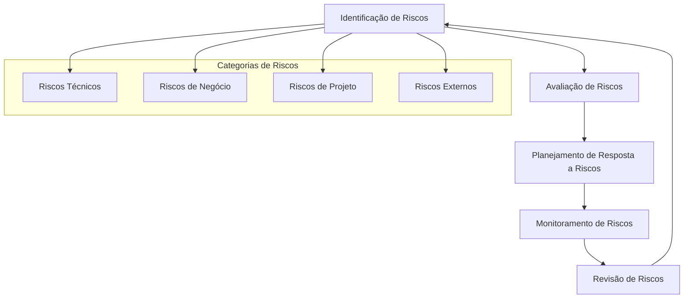
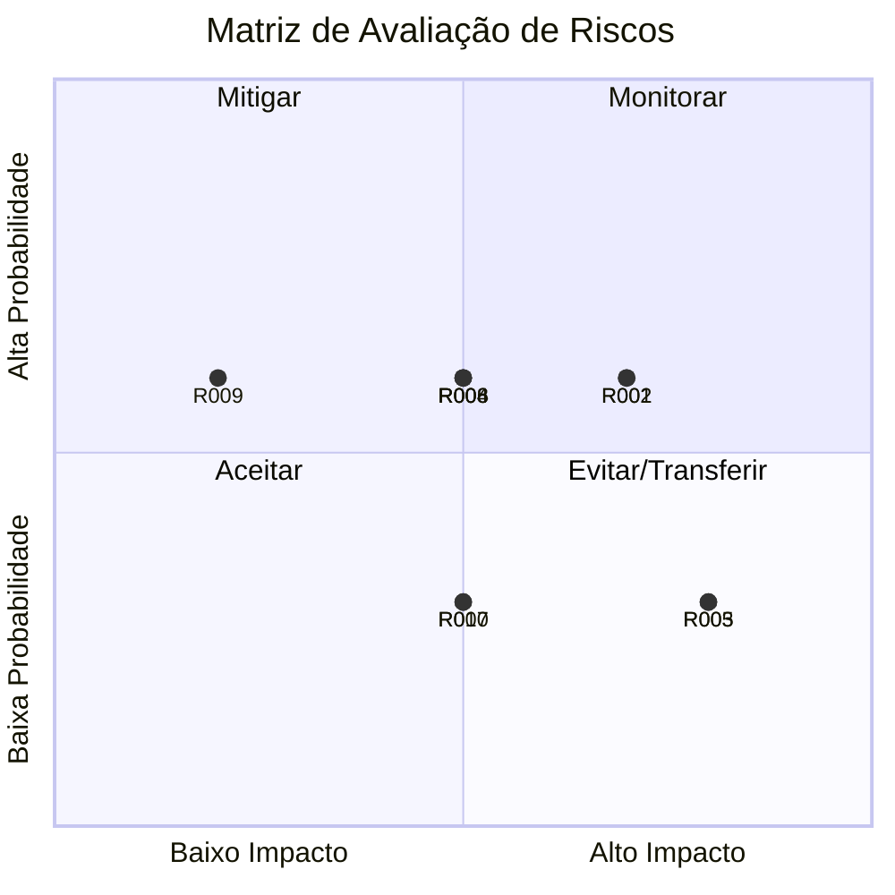
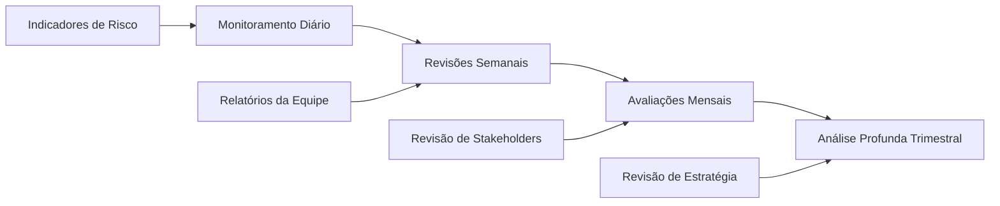

# Gestão de Riscos

## Abordagem de Gestão de Riscos

Seguindo a metodologia PRINCE2, este projeto implementa uma estrutura abrangente de gestão de riscos para identificar, avaliar e mitigar ameaças potenciais ao sucesso do projeto. Nossa abordagem garante gestão proativa de riscos durante todo o ciclo de vida do projeto.

### Estrutura de Gestão de Riscos

### Tolerância a Riscos

!!! info "Apetite a Riscos"
    
    **Alta Tolerância**: Inovação técnica e otimização de performance
    **Média Tolerância**: Variações de cronograma dentro de 10% da linha de base
    **Baixa Tolerância**: Estouros de orçamento, vulnerabilidades de segurança, questões de compliance
    **Tolerância Zero**: Perda de dados, downtime do sistema >4 horas, violações de segurança

## Registro de Riscos

### Riscos de Alta Prioridade

| ID Risco | Descrição do Risco | Categoria | Probabilidade | Impacto | Pontuação | Status |
|----------|-------------------|-----------|---------------|---------|-----------|--------|
| **R001** | Problemas de compatibilidade do FullCalendar v3 com futuras atualizações do Salesforce | Técnico | Médio | Alto | 12 | :material-alert: Ativo |
| **R002** | Resistência à adoção de usuários devido a mudanças na interface | Negócio | Médio | Alto | 12 | :material-check: Mitigado |
| **R003** | Degradação de performance com grandes datasets (>10K eventos) | Técnico | Baixo | Alto | 8 | :material-check: Mitigado |
| **R004** | Complexidade de integração com customizações Salesforce existentes | Técnico | Médio | Médio | 9 | :material-alert: Ativo |
| **R005** | Indisponibilidade de desenvolvedor-chave durante fases críticas | Projeto | Baixo | Alto | 8 | :material-check: Mitigado |

### Riscos de Média Prioridade

| ID Risco | Descrição do Risco | Categoria | Probabilidade | Impacto | Pontuação | Status |
|----------|-------------------|-----------|---------------|---------|-----------|--------|
| **R006** | Vulnerabilidades de segurança em bibliotecas externas | Técnico | Médio | Médio | 6 | :material-eye: Monitorando |
| **R007** | Problemas de responsividade móvel em vários dispositivos | Técnico | Baixo | Médio | 4 | :material-check: Mitigado |
| **R008** | Complexidade de migração de dados de sistemas legados | Negócio | Médio | Médio | 6 | :material-alert: Ativo |
| **R009** | Restrições de disponibilidade de recursos de treinamento | Projeto | Médio | Baixo | 3 | :material-check: Mitigado |
| **R010** | Impactos de limitação de taxa de API de terceiros | Externo | Baixo | Médio | 4 | :material-eye: Monitorando |

### Riscos de Baixa Prioridade

| ID Risco | Descrição do Risco | Categoria | Probabilidade | Impacto | Pontuação | Status |
|----------|-------------------|-----------|---------------|---------|-----------|--------|
| **R011** | Problemas de compatibilidade de navegador com versões antigas | Técnico | Baixo | Baixo | 2 | :material-check: Aceito |
| **R012** | Picos de uso sazonal afetando performance | Negócio | Baixo | Baixo | 2 | :material-eye: Monitorando |
| **R013** | Sobrecarga de manutenção de documentação | Projeto | Médio | Baixo | 3 | :material-check: Mitigado |

## Matriz de Avaliação de Riscos

### Matriz Probabilidade vs Impacto

## Análise Detalhada de Riscos

### R001: Compatibilidade do FullCalendar v3

!!! danger "Risco de Alta Prioridade"
    
    **Descrição**: FullCalendar v3 pode se tornar incompatível com futuras atualizações da plataforma Salesforce
    
    **Impacto**: Falha do sistema, redevelopment completo necessário
    
    **Probabilidade**: Médio (40-60%)
    
    **Pontuação de Risco**: 12 (Alto)

**Estratégias de Mitigação**:

=== "Mitigação Primária"

    - **Planejamento de Migração**: Desenvolver plano de migração para FullCalendar v6
    - **Monitoramento de Versões**: Acompanhar anúncios de compatibilidade Salesforce
    - **Desenvolvimento de Fallback**: Criar alternativa de calendário leve
    - **Cronograma**: Janela de migração identificada para Q2 2025

=== "Planos de Contingência"

    - **Resposta de Emergência**: Equipe de resposta de 48 horas para questões críticas
    - **Soluções Alternativas**: Avaliar componentes de calendário nativos Salesforce
    - **Suporte de Fornecedor**: Estabelecer contrato de suporte com equipe FullCalendar

**Indicadores de Monitoramento**:
- Notas de release Salesforce mencionando restrições de bibliotecas JavaScript
- Discussões da comunidade FullCalendar sobre compatibilidade Salesforce
- Degradação de performance em ambientes sandbox

### R002: Resistência à Adoção de Usuários

!!! warning "Risco de Alta Prioridade"
    
    **Descrição**: Usuários podem resistir à adoção da nova interface de calendário
    
    **Impacto**: Baixa utilização, ROI do projeto não alcançado
    
    **Probabilidade**: Médio (40-60%)
    
    **Pontuação de Risco**: 12 (Alto)

**Estratégias de Mitigação**:

=== "Gestão de Mudanças"

    - **Engajamento Precoce**: Envolver usuários-chave no processo de design
    - **Programa de Treinamento**: Abordagem de treinamento abrangente multi-modal
    - **Rede de Campeões**: Identificar e treinar power users como defensores
    - **Loops de Feedback**: Coleta e resposta regular de feedback do usuário

=== "Experiência do Usuário"

    - **Design Familiar**: Interface inspirada no Teams para familiaridade
    - **Divulgação Progressiva**: Introdução gradual de recursos
    - **Sistema de Ajuda**: Ajuda contextual e tooltips
    - **Vitórias Rápidas**: Demonstração imediata de valor

**Métricas de Sucesso**:
- 90% de adoção de usuários em 6 meses
- Avaliação de satisfação do usuário de 4,5/5
- <5% de volume de tickets de suporte após mês 2

### R003: Performance com Grandes Datasets

!!! info "Risco Técnico"
    
    **Descrição**: Performance do sistema pode degradar com grandes datasets de eventos
    
    **Impacto**: Experiência do usuário ruim, timeouts do sistema
    
    **Probabilidade**: Baixo (20-40%)
    
    **Pontuação de Risco**: 8 (Médio-Alto)

**Estratégias de Mitigação**:

=== "Otimização de Performance"

    - **Lazy Loading**: Implementar carregamento progressivo de dados
    - **Estratégia de Cache**: Implementação de cache multi-camadas
    - **Paginação de Dados**: Limitar carregamentos iniciais de dados
    - **Processamento em Background**: Operações assíncronas para tarefas pesadas

=== "Monitoramento & Escalabilidade"

    - **Métricas de Performance**: Dashboard de monitoramento em tempo real
    - **Teste de Carga**: Testes regulares de performance com grandes datasets
    - **Planos de Escalabilidade**: Estratégias de escalabilidade horizontal
    - **Revisões de Otimização**: Revisões trimestrais de performance

## Estratégias de Resposta a Riscos

### Tipos de Resposta

=== "Evitar"

    **Riscos de Alto Impacto, Alta Probabilidade**
    
    - Mudar abordagem do projeto para eliminar risco
    - Seleção de tecnologia alternativa
    - Redução de escopo para evitar áreas de risco

=== "Mitigar"

    **Riscos de Médio a Alto Impacto**
    
    - Reduzir probabilidade através de ações preventivas
    - Minimizar impacto através de medidas protetivas
    - Implementar sistemas de alerta precoce

=== "Transferir"

    **Riscos Fora do Controle do Projeto**
    
    - Cobertura de seguro para riscos específicos
    - Acordos de responsabilidade de fornecedores
    - Terceirização de componentes de alto risco

=== "Aceitar"

    **Riscos de Baixo Impacto, Baixa Probabilidade**
    
    - Reconhecer existência do risco
    - Monitorar mudanças
    - Preparar fundos de contingência

### Planejamento de Resposta a Riscos

!!! tip "Estrutura de Resposta"
    
    **Ações Imediatas** (0-24 horas)
    
    - Procedimentos de escalação de riscos
    - Ativação de equipe de resposta de emergência
    - Protocolos de comunicação com stakeholders
    
    **Ações de Curto Prazo** (1-7 dias)
    
    - Avaliação detalhada de impacto
    - Implementação de estratégia de mitigação
    - Realocação de recursos se necessário
    
    **Ações de Longo Prazo** (1-4 semanas)
    
    - Melhorias de processo
    - Implementação de medidas preventivas
    - Documentação de lições aprendidas

## Monitoramento e Controle de Riscos

### Estrutura de Monitoramento

### Indicadores-Chave de Risco (KRIs)

| Área de Risco | Indicador | Limite | Ação |
|---------------|-----------|--------|------|
| **Performance** | Tempo de carregamento de página | >3 segundos | Otimização imediata |
| **Adoção** | Frequência de login do usuário | <70% semanal | Treinamento aprimorado |
| **Técnico** | Taxa de erro | >2% | Revisão técnica |
| **Segurança** | Scan de vulnerabilidade | Qualquer alta/crítica | Correção imediata |

### Relatórios e Comunicação

!!! info "Plano de Comunicação de Riscos"
    
    **Diário**: Monitoramento de indicadores de risco pela equipe do projeto
    **Semanal**: Atualizações de status de risco para gerente de projeto
    **Mensal**: Dashboard de riscos para conselho do projeto
    **Trimestral**: Revisão abrangente de riscos com stakeholders

### Processo de Revisão de Riscos

=== "Revisões Mensais de Riscos"

    **Agenda**:
    1. Atualizações do registro de riscos
    2. Identificação de novos riscos
    3. Revisão de efetividade de mitigação
    4. Análise de tendências de riscos
    5. Atualizações de planos de ação

=== "Revisões Estratégicas Trimestrais"

    **Áreas de Foco**:
    - Reavaliação de apetite a riscos
    - Mudanças no cenário de riscos estratégicos
    - Melhorias no processo de gestão de riscos
    - Integração de lições aprendidas

## Planejamento de Contingência

### Continuidade de Negócio

!!! shield "Medidas de Continuidade"
    
    **Cenários de Falha do Sistema**:
    
    - **Sistema de Fallback**: Calendário básico Salesforce como backup
    - **Recuperação de Dados**: Metas de RTO de 4 horas, RPO de 1 hora
    - **Plano de Comunicação**: Notificação de stakeholders em 30 minutos
    - **Equipe de Recuperação**: Suporte técnico 24/7 de plantão

### Resposta de Emergência

**Matriz de Escalação**:

| Severidade | Tempo de Resposta | Nível de Escalação | Autoridade |
|------------|-------------------|-------------------|------------|
| **Crítico** | 15 minutos | Executivo do Projeto | Autoridade total |
| **Alto** | 1 hora | Gerente de Projeto | Orçamento <R$ 10K |
| **Médio** | 4 horas | Líder Técnico | Decisões técnicas |
| **Baixo** | 24 horas | Líder da Equipe | Procedimentos padrão |

---

**Status da Gestão de Riscos**: :material-check-circle:{ .green } Ativo  
**Última Revisão**: {{ git_revision_date_localized }}  
**Próxima Revisão**: Mensal  
**Proprietário do Risco**: Gerente de Projeto
