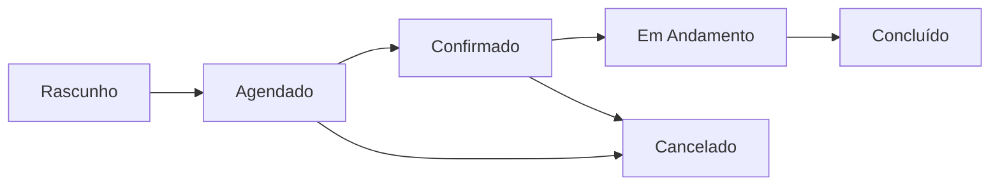

# Gestão de Eventos

## Introdução à Gestão de Eventos

O CalendarioReino oferece ferramentas completas para criar, editar e gerenciar eventos de forma eficiente. Esta seção cobre todos os aspectos da gestão de eventos, desde criação básica até recursos avançados.

## Criação de Eventos

### Métodos de Criação

#### Criação Rápida

**Clique Simples**:
1. Clique em uma data/horário vazio
2. Digite o título do evento
3. Pressione Enter para salvar

**Vantagens**:
- Muito rápido para eventos simples
- Usa configurações padrão
- Ideal para lembretes rápidos

#### Criação Completa

**Formulário Detalhado**:
1. Clique no botão "Novo Evento" ou `Ctrl+N`
2. Preencha todos os campos necessários
3. Configure opções avançadas
4. Salve o evento

**Campos Disponíveis**:
- Título (obrigatório)
- Data e horário
- Duração ou horário de término
- Descrição/agenda
- Local ou sala
- Participantes
- Tipo de evento
- Prioridade
- Lembretes
- Recorrência
- Visibilidade

### Tipos de Eventos

!!! info "Categorias de Eventos"
    
    **Reuniões** 👥
    - Eventos com múltiplos participantes
    - Reserva automática de sala
    - Envio de convites
    - Controle de presença
    
    **Compromissos** 📅
    - Eventos pessoais ou individuais
    - Bloqueios de agenda
    - Lembretes pessoais
    
    **Tarefas** ✅
    - Itens de ação com prazo
    - Acompanhamento de progresso
    - Marcação de conclusão
    
    **Eventos** 🎉
    - Acontecimentos especiais
    - Celebrações ou marcos
    - Comunicação ampla

## Edição de Eventos

### Edição Inline

**Para eventos simples**:
1. Clique duplo no evento
2. Edite o título diretamente
3. Pressione Enter para salvar
4. Escape para cancelar

### Edição Completa

**Acesso**:
- Clique direito → "Editar"
- Clique simples → Painel de detalhes → "Editar"
- Atalho `F2` com evento selecionado

**Formulário de Edição**:
Identical ao formulário de criação, mas com dados preenchidos.

### Movimentação de Eventos

#### Arrastar e Soltar

**Mover para Nova Data**:
1. Clique e arraste o evento
2. Solte na nova data
3. Confirme se necessário

**Alterar Horário**:
1. Arraste verticalmente (visualização semanal/diária)
2. Evento se move para novo horário
3. Duração é mantida

**Redimensionar Duração**:
1. Passe o mouse na borda do evento
2. Cursor muda para redimensionamento
3. Arraste para ajustar início ou fim

#### Ajustes Precisos

**Via Formulário**:
- Edite campos de data/hora diretamente
- Use seletores de tempo precisos
- Configure durações específicas

## Gestão de Participantes

### Adicionando Participantes

#### Busca de Usuários

1. **Campo "Participantes"** no formulário
2. **Digite o nome** do usuário
3. **Selecione** da lista de sugestões
4. **Defina o tipo**:
   - Obrigatório
   - Opcional
   - Organizador

#### Verificação de Disponibilidade

**Visualização de Conflitos**:
- Sistema mostra automaticamente conflitos
- Sugestões de horários alternativos
- Indicação de usuários indisponíveis

### Tipos de Participação

| Tipo | Descrição | Comportamento |
|------|-----------|---------------|
| **Organizador** | Responsável pelo evento | Pode editar e cancelar |
| **Obrigatório** | Presença essencial | Deve confirmar presença |
| **Opcional** | Presença desejável | Pode declinar sem impacto |
| **Informativo** | Apenas para conhecimento | Recebe notificação |

### Gestão de Respostas

#### Status de Resposta

- ✅ **Aceito**: Participante confirmou presença
- ❌ **Recusado**: Participante declinou
- ⏳ **Pendente**: Aguardando resposta
- ❓ **Tentativa**: Resposta condicional

#### Ações do Organizador

- **Enviar lembretes** para respostas pendentes
- **Ver quem respondeu** em tempo real
- **Ajustar evento** baseado nas respostas
- **Cancelar se necessário**

## Recursos Avançados

### Eventos Recorrentes

#### Tipos de Recorrência

**Padrões Disponíveis**:
- Diário (todos os dias, dias úteis)
- Semanal (dias específicos da semana)
- Mensal (mesmo dia do mês, mesmo dia da semana)
- Anual (mesma data)
- Personalizado (intervalos específicos)

#### Configuração

1. **Marque "Evento Recorrente"**
2. **Selecione o padrão**
3. **Configure frequência**
4. **Defina data final** (opcional)
5. **Salve a série**

#### Gestão de Séries

**Editando Eventos Recorrentes**:
- **Este evento**: Altera apenas uma ocorrência
- **Todos os eventos**: Altera toda a série
- **Este e futuros**: Altera da data em diante

### Lembretes e Notificações

#### Tipos de Lembrete

!!! tip "Opções de Lembrete"
    
    **Email**
    - 15 minutos antes
    - 1 hora antes
    - 1 dia antes
    - Personalizado
    
    **Popup**
    - Notificação no navegador
    - Som opcional
    - Ação de soneca
    
    **Mobile**
    - Push notification
    - Integração com calendário do dispositivo

#### Configuração Múltipla

- **Múltiplos lembretes** por evento
- **Diferentes tipos** combinados
- **Lembretes personalizados** por participante

### Templates de Eventos

#### Criação de Templates

1. **Crie um evento** com configurações desejadas
2. **Salve como template**
3. **Defina nome** do template
4. **Configure campos variáveis**

#### Uso de Templates

1. **Selecione template** na criação
2. **Campos são preenchidos** automaticamente
3. **Ajuste conforme necessário**
4. **Salve o evento**

**Templates Comuns**:
- Reunião de equipe semanal
- One-on-one quinzenal
- Apresentação para cliente
- Treinamento interno

## Integração com Salas

### Reserva Automática

#### Processo Integrado

1. **Defina local** no evento
2. **Sistema busca salas** disponíveis
3. **Selecione sala** apropriada
4. **Reserva é feita** automaticamente
5. **Conflitos são evitados**

#### Critérios de Seleção

**Automática**:
- Capacidade adequada
- Recursos necessários
- Proximidade dos participantes
- Disponibilidade no horário

**Manual**:
- Lista de salas disponíveis
- Detalhes de cada sala
- Reserva direcionada

### Recursos de Sala

#### Equipamentos Disponíveis

- 📺 **TV/Projetor**: Para apresentações
- 🎥 **Videoconferência**: Reuniões remotas
- 📻 **Sistema de som**: Audio claro
- 🖥️ **Computador**: Acesso a sistemas
- ☕ **Coffee break**: Serviço de café
- 📝 **Quadro**: Para anotações

#### Configuração por Evento

**Solicitar Recursos**:
- Selecione recursos necessários
- Sistema filtra salas compatíveis
- Reserva inclui equipamentos
- Preparação automática quando possível

## Estados e Status de Eventos

### Ciclo de Vida

### Descrição dos Estados

| Estado | Descrição | Ações Disponíveis |
|--------|-----------|-------------------|
| **Rascunho** | Em criação | Editar, excluir |
| **Agendado** | Criado, aguardando confirmações | Editar, cancelar, confirmar |
| **Confirmado** | Todos confirmaram | Editar, cancelar, iniciar |
| **Em Andamento** | Evento acontecendo | Finalizar, estender |
| **Concluído** | Evento finalizado | Visualizar, relatório |
| **Cancelado** | Evento cancelado | Reativar, excluir |

## Relatórios e Analytics

### Métricas de Eventos

#### Dados Disponíveis

**Por Organizador**:
- Número de eventos criados
- Taxa de comparecimento
- Duração média de reuniões
- Uso de salas

**Por Participante**:
- Eventos participados
- Taxa de aceitação
- Pontualidade
- Feedback de reuniões

#### Relatórios Pré-definidos

- **Utilização de salas** por período
- **Produtividade** de reuniões
- **Padrões de agendamento**
- **Conflitos** e resoluções

### Exportação

#### Formatos Disponíveis

- **PDF**: Relatórios formatados
- **Excel**: Dados para análise
- **iCal**: Importação em outros calendários
- **JSON**: Integração com sistemas

## Melhores Práticas

### Para Organizadores

!!! success "Dicas de Organização"
    
    **Planejamento**
    - Defina objetivos claros
    - Prepare agenda antecipadamente
    - Reserve tempo adequado
    - Escolha horários convenientes
    
    **Comunicação**
    - Envie convites com antecedência
    - Inclua agenda na descrição
    - Confirme presença antes
    - Envie materiais prévios
    
    **Execução**
    - Comece e termine no horário
    - Mantenha foco nos objetivos
    - Documente decisões
    - Defina próximos passos

### Para Participantes

!!! tip "Participação Efetiva"
    
    **Preparação**
    - Leia agenda antecipadamente
    - Prepare materiais necessários
    - Revise tópicos relevantes
    - Chegue pontualmente
    
    **Durante o Evento**
    - Participe ativamente
    - Faça perguntas relevantes
    - Tome notas importantes
    - Respeite o tempo
    
    **Pós-Evento**
    - Revise anotações
    - Execute ações definidas
    - Forneça feedback
    - Acompanhe resultados

---

**Próximo**: [Reserva de Salas](room-booking.md)  
**Anterior**: [Navegação Básica](navigation.md)
