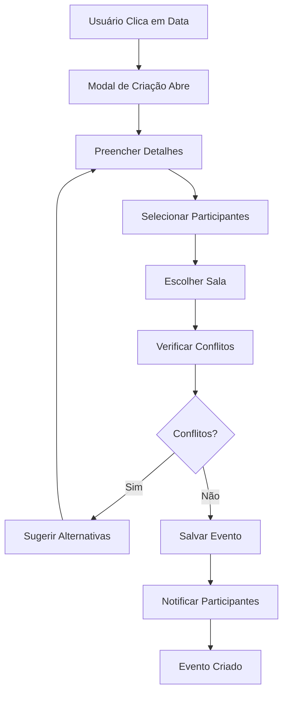
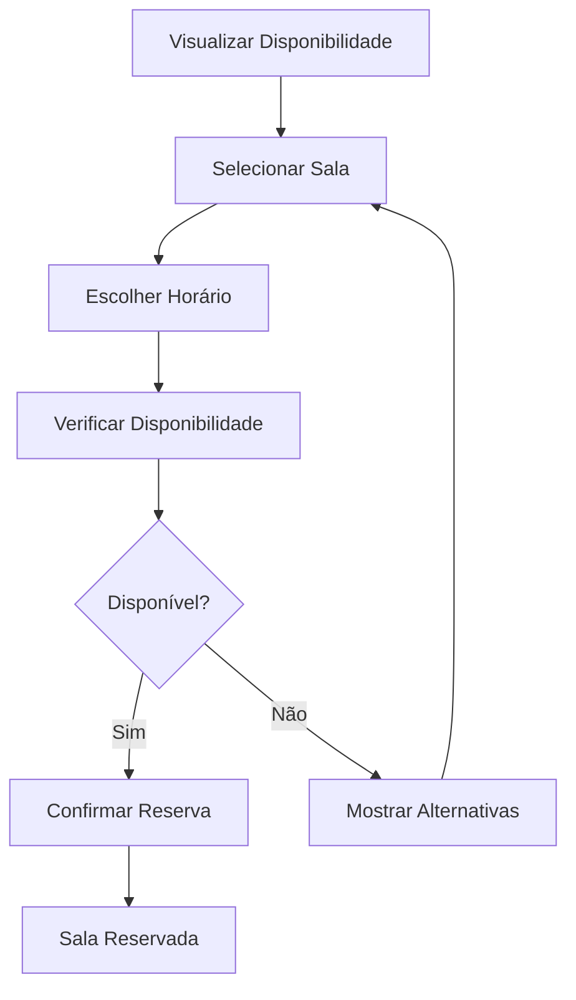
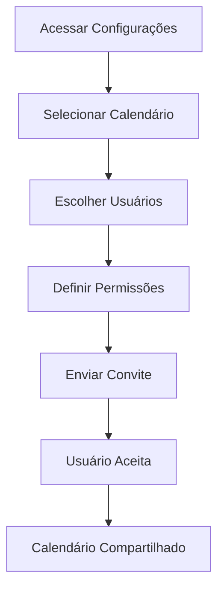

# Documentação do Usuário

## Bem-vindo ao CalendarioReino

Esta seção fornece documentação abrangente para usuários finais do CalendarioReino, incluindo guias de instalação, manuais do usuário, configuração e solução de problemas. Seja você um administrador configurando o sistema ou um usuário final aprendendo a usar os recursos, você encontrará toda a informação necessária aqui.

### Visão Geral para Usuários

**CalendarioReino** é uma solução avançada de gestão de calendário construída especificamente para o Salesforce. Ele transforma como sua organização gerencia reuniões, compromissos e recursos, proporcionando uma experiência intuitiva e poderosa.

### Principais Benefícios para Usuários

!!! success "Por que Usar o CalendarioReino?"
    
    **Eficiência Aprimorada**
    
    - Agendamento de reuniões 50% mais rápido
    - Detecção automática de conflitos
    - Reserva de salas com um clique
    - Sincronização em tempo real
    
    **Experiência Intuitiva**
    
    - Interface familiar inspirada no Teams
    - Funcionalidade arrastar e soltar
    - Design responsivo para todos os dispositivos
    - Navegação simplificada
    
    **Colaboração Aprimorada**
    
    - Compartilhamento fácil de calendários
    - Gestão de participantes
    - Visibilidade de disponibilidade em tempo real
    - Comunicação integrada

## Estrutura da Documentação do Usuário

### Para Administradores

=== "Configuração Inicial"

    - [Guia de Instalação](installation.md) - Implementação e configuração do sistema
    - [Configuração](configuration.md) - Personalização para sua organização
    - [Gestão de Usuários](user-management.md) - Configuração de permissões e acesso
    - [Configuração de Salas](room-setup.md) - Configuração de salas de reunião

=== "Administração Contínua"

    - [Manutenção do Sistema](maintenance.md) - Tarefas de manutenção regulares
    - [Monitoramento](monitoring.md) - Acompanhamento de performance e uso
    - [Backup e Recuperação](backup.md) - Proteção de dados
    - [Atualizações](updates.md) - Gestão de versões e atualizações

### Para Usuários Finais

=== "Começando"

    - [Manual do Usuário](manual.md) - Guia completo de funcionalidades
    - [Primeiros Passos](first-steps.md) - Tutorial para novos usuários
    - [Interface do Usuário](interface.md) - Visão geral da interface
    - [Navegação Básica](navigation.md) - Como navegar no sistema

=== "Recursos Avançados"

    - [Gestão de Eventos](event-management.md) - Criação e edição de eventos
    - [Reserva de Salas](room-booking.md) - Como reservar e gerenciar salas
    - [Compartilhamento](sharing.md) - Compartilhamento de calendários
    - [Personalização](customization.md) - Personalizar sua experiência

### Para Suporte

=== "Solução de Problemas"

    - [Solução de Problemas](troubleshooting.md) - Problemas comuns e soluções
    - [FAQ](faq.md) - Perguntas frequentes
    - [Códigos de Erro](error-codes.md) - Referência de códigos de erro
    - [Logs e Diagnósticos](diagnostics.md) - Ferramentas de diagnóstico

=== "Recursos de Ajuda"

    - [Contato de Suporte](support.md) - Como obter ajuda
    - [Treinamento](training.md) - Recursos de treinamento disponíveis
    - [Comunidade](community.md) - Fóruns e comunidade de usuários
    - [Atualizações](updates.md) - Notas de versão e novidades

## Tipos de Usuário

### Administrador do Sistema

**Responsabilidades:**
- Configuração inicial e manutenção do sistema
- Gestão de usuários e permissões
- Configuração de salas e recursos
- Monitoramento de performance
- Resolução de problemas técnicos

**Recursos Principais:**
- Acesso completo a configurações
- Ferramentas de diagnóstico
- Relatórios de uso e performance
- Gestão de backup e recuperação

### Gerente de Facilities

**Responsabilidades:**
- Gestão de salas de reunião
- Configuração de recursos
- Monitoramento de utilização
- Resolução de conflitos de reserva

**Recursos Principais:**
- Dashboard de utilização de salas
- Configuração de disponibilidade
- Relatórios de ocupação
- Gestão de equipamentos

### Usuário Final

**Responsabilidades:**
- Criação e gestão de eventos
- Reserva de salas
- Participação em reuniões
- Manutenção de calendário pessoal

**Recursos Principais:**
- Interface de calendário intuitiva
- Criação rápida de eventos
- Busca e filtros
- Notificações e lembretes

### Power User

**Responsabilidades:**
- Uso avançado de recursos
- Suporte a outros usuários
- Feedback para melhorias
- Treinamento de novos usuários

**Recursos Principais:**
- Recursos avançados de filtragem
- Personalização estendida
- Integração com outras ferramentas
- Relatórios personalizados

## Requisitos do Sistema

### Requisitos Técnicos

!!! info "Especificações Mínimas"
    
    **Plataforma**
    
    - Salesforce Lightning Experience
    - Versão mínima: Spring '23
    - Licenças: Salesforce ou Platform
    
    **Navegadores Suportados**
    
    - Google Chrome 90+
    - Mozilla Firefox 88+
    - Microsoft Edge 90+
    - Safari 14+ (macOS/iOS)
    
    **Dispositivos**
    
    - Desktop: Resolução mínima 1024x768
    - Tablet: iOS 13+, Android 8+
    - Mobile: iOS 13+, Android 8+

### Permissões Necessárias

=== "Objetos Padrão"

    **Event Object**
    - Read, Create, Edit, Delete
    - Acesso a todos os campos padrão
    - Acesso a campos customizados
    
    **Activity Object**
    - Read, Create, Edit
    - Acesso a campos de relacionamento
    
    **User Object**
    - Read (para busca de usuários)
    - Acesso a campos de perfil

=== "Recursos da Plataforma"

    **Lightning Components**
    - Acesso a Lightning Web Components
    - Execução de JavaScript
    
    **Apex Classes**
    - Execução de controladores Apex
    - Acesso a métodos remotos
    
    **Static Resources**
    - Acesso a bibliotecas JavaScript
    - Carregamento de recursos CSS

## Fluxos de Trabalho Comuns

### Agendamento de Reunião

### Reserva de Sala

### Compartilhamento de Calendário

## Melhores Práticas

### Para Usuários

!!! tip "Dicas de Uso Eficiente"
    
    **Agendamento**
    
    - Use títulos descritivos para eventos
    - Inclua agenda na descrição
    - Defina lembretes apropriados
    - Verifique disponibilidade antes de agendar
    
    **Gestão de Calendário**
    
    - Mantenha calendário atualizado
    - Use cores para categorizar eventos
    - Configure visualização padrão
    - Sincronize com outros calendários
    
    **Colaboração**
    
    - Compartilhe calendários relevantes
    - Responda a convites prontamente
    - Use salas apropriadas para o tamanho da reunião
    - Cancele reuniões desnecessárias

### Para Administradores

!!! success "Práticas Recomendadas"
    
    **Configuração**
    
    - Configure permissões adequadas
    - Estabeleça convenções de nomenclatura
    - Defina políticas de uso
    - Monitore performance regularmente
    
    **Manutenção**
    
    - Faça backups regulares
    - Monitore logs de erro
    - Atualize documentação
    - Treine novos usuários
    
    **Suporte**
    
    - Estabeleça canais de suporte
    - Documente problemas comuns
    - Mantenha base de conhecimento
    - Colete feedback dos usuários

## Recursos de Ajuda

### Documentação

- **Guias Passo a Passo**: Tutoriais detalhados para tarefas comuns
- **Referência de Recursos**: Documentação completa de funcionalidades
- **Vídeos Tutoriais**: Demonstrações visuais de recursos
- **FAQ**: Respostas para perguntas frequentes

### Suporte

- **Help Desk**: Suporte técnico direto
- **Fóruns da Comunidade**: Discussões com outros usuários
- **Treinamento**: Sessões de treinamento agendadas
- **Documentação Online**: Acesso 24/7 a recursos

### Contato

!!! question "Precisa de Ajuda?"
    
    **Suporte Técnico**: suporte@empresa.com
    **Treinamento**: treinamento@empresa.com
    **Feedback**: feedback@empresa.com
    **Emergências**: +55 11 9999-9999

---

**Status da Documentação**: :material-check-circle:{ .green } Atualizada  
**Última Revisão**: {{ git_revision_date_localized }}  
**Próxima Atualização**: Mensal  
**Responsável**: Equipe de Suporte
