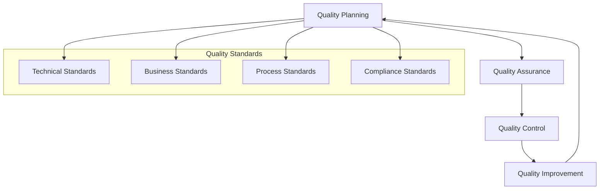
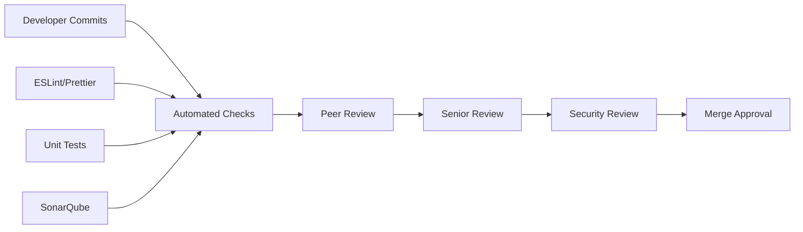
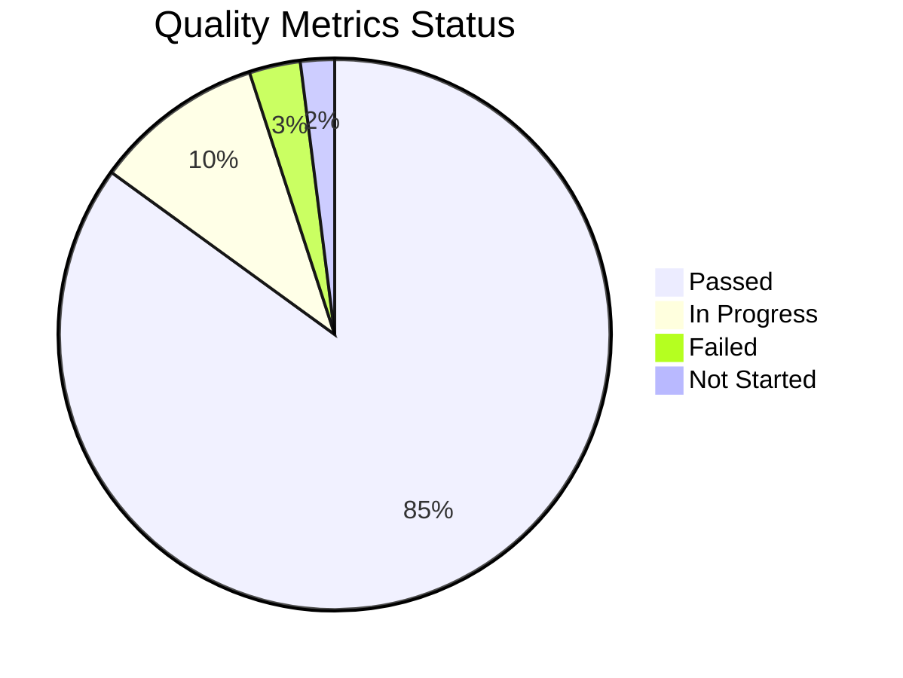
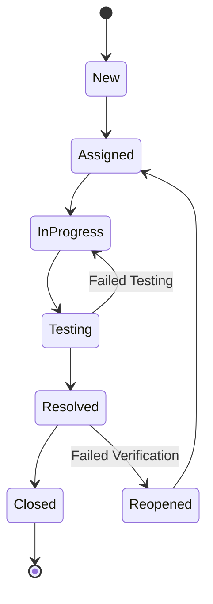

# Quality Management

## Quality Management Approach

Following PRINCE2 quality management practices, this project implements a comprehensive quality framework to ensure deliverables meet defined standards and stakeholder expectations. Our approach emphasizes prevention over detection and continuous improvement throughout the project lifecycle.

### Quality Framework

### Quality Objectives

!!! success "Quality Goals"
    
    **Technical Excellence**
    
    - 99.5% system availability
    - <2 second average response time
    - Zero critical security vulnerabilities
    - 95% code coverage in unit tests
    
    **User Experience**
    
    - 4.5/5 user satisfaction rating
    - <3 clicks for common tasks
    - WCAG 2.1 AA accessibility compliance
    - Mobile responsiveness across all devices
    
    **Business Value**
    
    - 100% functional requirements met
    - 90% user adoption within 6 months
    - ROI targets achieved within 18 months
    - Zero data loss incidents

## Quality Standards

### Technical Standards

=== "Code Quality"

    **Salesforce Standards**
    
    - Lightning Web Component best practices
    - Apex coding standards and conventions
    - Security review requirements (FLS, CRUD, Sharing)
    - Performance optimization guidelines
    
    **JavaScript Standards**
    
    - ESLint configuration for code quality
    - Prettier for consistent formatting
    - JSDoc documentation requirements
    - Modern ES6+ syntax usage
    
    **CSS Standards**
    
    - Salesforce Lightning Design System (SLDS) compliance
    - BEM methodology for class naming
    - Responsive design principles
    - Cross-browser compatibility

=== "Architecture Standards"

    **Component Design**
    
    - Single Responsibility Principle
    - Loose coupling, high cohesion
    - Reusable component patterns
    - Clear separation of concerns
    
    **Integration Standards**
    
    - RESTful API design principles
    - Error handling and logging standards
    - Data validation and sanitization
    - Secure communication protocols

=== "Performance Standards"

    **Response Time Requirements**
    
    | Operation | Target | Maximum |
    |-----------|--------|---------|
    | Page Load | <2 seconds | 3 seconds |
    | Event Creation | <1 second | 2 seconds |
    | Calendar Navigation | <0.5 seconds | 1 second |
    | Search Results | <1 second | 2 seconds |
    
    **Scalability Requirements**
    
    - Support 1000+ concurrent users
    - Handle 50,000+ events per user
    - 99.5% uptime SLA
    - Graceful degradation under load

### Business Standards

=== "Functional Requirements"

    **Core Functionality**
    
    - ✅ Calendar view management (month, week, day)
    - ✅ Event creation, editing, and deletion
    - ✅ Meeting room booking and management
    - ✅ Multi-user calendar sharing
    - ✅ Real-time availability checking
    - ✅ Advanced filtering and search
    
    **User Experience Requirements**
    
    - Intuitive interface design
    - Consistent interaction patterns
    - Contextual help and guidance
    - Error prevention and recovery
    - Accessibility for all users

=== "Business Process Standards"

    **Meeting Management**
    
    - Automated conflict detection
    - Resource availability validation
    - Participant notification system
    - Meeting outcome tracking
    
    **Data Management**
    
    - Data integrity validation
    - Audit trail maintenance
    - Backup and recovery procedures
    - Privacy and confidentiality

### Compliance Standards

!!! shield "Regulatory Compliance"
    
    **Data Protection**
    
    - GDPR compliance for EU users
    - Data minimization principles
    - Right to be forgotten implementation
    - Consent management
    
    **Security Standards**
    
    - OWASP Top 10 vulnerability prevention
    - Salesforce security best practices
    - Regular security assessments
    - Incident response procedures
    
    **Accessibility Standards**
    
    - WCAG 2.1 AA compliance
    - Screen reader compatibility
    - Keyboard navigation support
    - Color contrast requirements

## Quality Assurance Process

### Quality Planning

#### Quality Criteria Definition

For each deliverable, we define specific quality criteria:

=== "Code Deliverables"

    **Acceptance Criteria**
    
    - All functional requirements implemented
    - Unit test coverage >95%
    - Code review approval from senior developer
    - Security review passed
    - Performance benchmarks met
    
    **Quality Measures**
    
    - Cyclomatic complexity <10
    - No critical SonarQube violations
    - Documentation coverage >90%
    - Zero known security vulnerabilities

=== "Documentation Deliverables"

    **Acceptance Criteria**
    
    - Complete coverage of all features
    - Clear, concise writing style
    - Accurate technical information
    - Proper formatting and structure
    - Stakeholder review approval
    
    **Quality Measures**
    
    - Readability score >70
    - Zero broken links or references
    - Consistent terminology usage
    - Up-to-date screenshots and examples

### Quality Control Activities

#### Code Review Process

**Review Checklist**:

!!! check "Code Review Criteria"
    
    - [ ] Functional requirements met
    - [ ] Code follows established standards
    - [ ] Adequate error handling implemented
    - [ ] Security best practices followed
    - [ ] Performance considerations addressed
    - [ ] Unit tests written and passing
    - [ ] Documentation updated
    - [ ] No code smells or anti-patterns

#### Testing Strategy

=== "Unit Testing"

    **Coverage Requirements**
    
    - Apex classes: >95% coverage
    - JavaScript functions: >90% coverage
    - Critical path testing: 100% coverage
    - Edge case testing: Comprehensive
    
    **Testing Framework**
    
    - Salesforce native testing for Apex
    - Jest for JavaScript unit tests
    - Mock frameworks for external dependencies
    - Automated test execution in CI/CD

=== "Integration Testing"

    **Test Scenarios**
    
    - Salesforce platform integration
    - External library compatibility
    - Cross-browser functionality
    - Mobile device responsiveness
    - API endpoint validation
    
    **Test Environment**
    
    - Dedicated testing sandbox
    - Production-like data volumes
    - Multiple user profiles and permissions
    - Various device and browser combinations

=== "User Acceptance Testing"

    **UAT Process**
    
    1. **Test Plan Creation**: Detailed scenarios based on user stories
    2. **Test Environment Setup**: Production-like environment with real data
    3. **User Training**: Brief training on new features
    4. **Test Execution**: Users perform real-world scenarios
    5. **Feedback Collection**: Structured feedback and issue reporting
    6. **Issue Resolution**: Bug fixes and usability improvements
    7. **Sign-off**: Formal acceptance by business stakeholders

### Quality Metrics and Monitoring

#### Key Quality Indicators (KQIs)

| Metric | Target | Current | Trend | Action Required |
|--------|--------|---------|-------|-----------------|
| **Code Coverage** | >95% | 97.2% | ↗️ | None |
| **Bug Density** | <0.5/KLOC | 0.3/KLOC | ↘️ | None |
| **User Satisfaction** | >4.5/5 | 4.7/5 | ↗️ | None |
| **Performance** | <2s load | 1.8s avg | ↗️ | None |
| **Availability** | >99.5% | 99.8% | ↗️ | None |

#### Quality Dashboard

### Defect Management

#### Defect Classification

=== "Severity Levels"

    **Critical (P1)**
    
    - System crashes or data loss
    - Security vulnerabilities
    - Complete feature failure
    - **SLA**: 4 hours response, 24 hours resolution
    
    **High (P2)**
    
    - Major functionality impaired
    - Performance significantly degraded
    - Workaround available but difficult
    - **SLA**: 8 hours response, 72 hours resolution
    
    **Medium (P3)**
    
    - Minor functionality issues
    - Cosmetic problems affecting usability
    - Easy workaround available
    - **SLA**: 24 hours response, 1 week resolution
    
    **Low (P4)**
    
    - Enhancement requests
    - Documentation issues
    - Minor cosmetic problems
    - **SLA**: 1 week response, next release

#### Defect Lifecycle

## Quality Improvement

### Continuous Improvement Process

!!! tip "Improvement Cycle"
    
    **Plan**: Identify improvement opportunities
    **Do**: Implement improvements on small scale
    **Check**: Measure results and effectiveness
    **Act**: Standardize successful improvements

### Lessons Learned Integration

=== "Quality Retrospectives"

    **Monthly Reviews**
    
    - Quality metrics analysis
    - Process effectiveness evaluation
    - Team feedback collection
    - Improvement action planning
    
    **Quarterly Assessments**
    
    - Quality trend analysis
    - Benchmark comparisons
    - Process optimization opportunities
    - Training needs identification

=== "Best Practices Documentation"

    **Knowledge Management**
    
    - Quality standards documentation
    - Best practices repository
    - Lessons learned database
    - Training materials maintenance

### Quality Training and Competency

#### Training Program

!!! info "Quality Training Matrix"
    
    **Technical Training**
    
    - Salesforce development best practices
    - Code quality and review techniques
    - Testing methodologies and tools
    - Security awareness and practices
    
    **Process Training**
    
    - Quality management principles
    - PRINCE2 quality practices
    - Defect management procedures
    - Continuous improvement methods

#### Competency Assessment

Regular assessment of team quality competencies:

- Technical skill evaluations
- Quality process knowledge tests
- Practical application assessments
- Certification maintenance

---

**Quality Management Status**: :material-check-circle:{ .green } Active  
**Quality Metrics**: Meeting all targets  
**Last Assessment**: {{ git_revision_date_localized }}  
**Quality Manager**: Technical Lead
