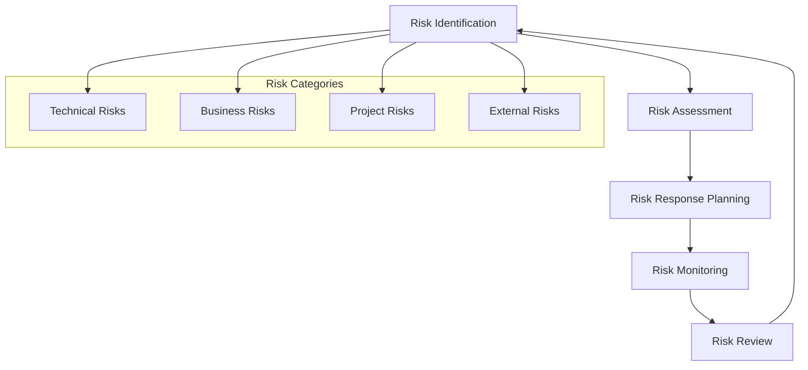
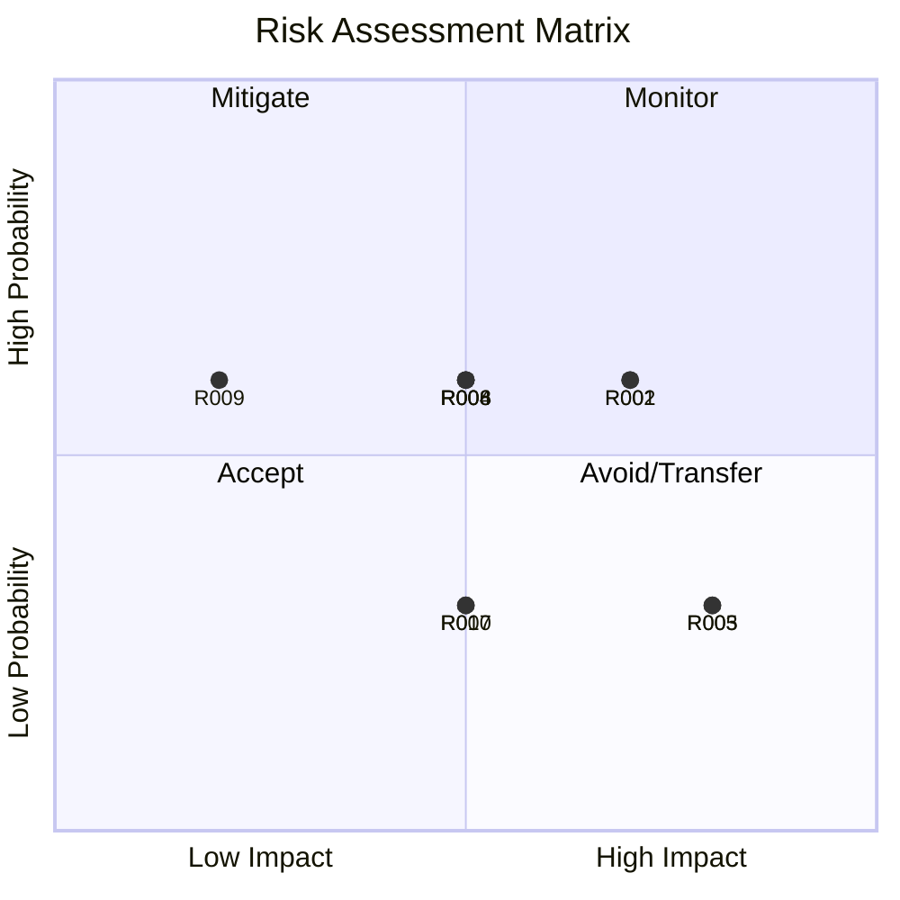
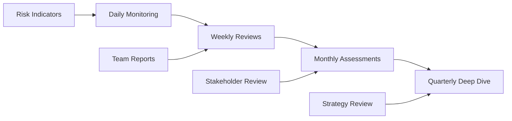

# Risk Management

## Risk Management Approach

Following PRINCE2 methodology, this project implements a comprehensive risk management framework to identify, assess, and mitigate potential threats to project success. Our approach ensures proactive risk management throughout the project lifecycle.

### Risk Management Framework

### Risk Tolerance

!!! info "Risk Appetite"
    
    **High Tolerance**: Technical innovation and performance optimization
    **Medium Tolerance**: Schedule variations within 10% of baseline
    **Low Tolerance**: Budget overruns, security vulnerabilities, compliance issues
    **Zero Tolerance**: Data loss, system downtime >4 hours, security breaches

## Risk Register

### High Priority Risks

| Risk ID | Risk Description | Category | Probability | Impact | Risk Score | Status |
|---------|------------------|----------|-------------|--------|------------|--------|
| **R001** | FullCalendar v3 compatibility issues with future Salesforce updates | Technical | Medium | High | 12 | :material-alert: Active |
| **R002** | User adoption resistance due to interface changes | Business | Medium | High | 12 | :material-check: Mitigated |
| **R003** | Performance degradation with large datasets (>10K events) | Technical | Low | High | 8 | :material-check: Mitigated |
| **R004** | Integration complexity with existing Salesforce customizations | Technical | Medium | Medium | 9 | :material-alert: Active |
| **R005** | Key developer unavailability during critical phases | Project | Low | High | 8 | :material-check: Mitigated |

### Medium Priority Risks

| Risk ID | Risk Description | Category | Probability | Impact | Risk Score | Status |
|---------|------------------|----------|-------------|--------|------------|--------|
| **R006** | External library security vulnerabilities | Technical | Medium | Medium | 6 | :material-eye: Monitoring |
| **R007** | Mobile responsiveness issues on various devices | Technical | Low | Medium | 4 | :material-check: Mitigated |
| **R008** | Data migration complexity from legacy systems | Business | Medium | Medium | 6 | :material-alert: Active |
| **R009** | Training resource availability constraints | Project | Medium | Low | 3 | :material-check: Mitigated |
| **R010** | Third-party API rate limiting impacts | External | Low | Medium | 4 | :material-eye: Monitoring |

### Low Priority Risks

| Risk ID | Risk Description | Category | Probability | Impact | Risk Score | Status |
|---------|------------------|----------|-------------|--------|------------|--------|
| **R011** | Browser compatibility issues with older versions | Technical | Low | Low | 2 | :material-check: Accepted |
| **R012** | Seasonal usage spikes affecting performance | Business | Low | Low | 2 | :material-eye: Monitoring |
| **R013** | Documentation maintenance overhead | Project | Medium | Low | 3 | :material-check: Mitigated |

## Risk Assessment Matrix

### Probability vs Impact Matrix

## Detailed Risk Analysis

### R001: FullCalendar v3 Compatibility

!!! danger "High Priority Risk"
    
    **Description**: FullCalendar v3 may become incompatible with future Salesforce platform updates
    
    **Impact**: System failure, complete redevelopment required
    
    **Probability**: Medium (40-60%)
    
    **Risk Score**: 12 (High)

**Mitigation Strategies**:

=== "Primary Mitigation"

    - **Migration Planning**: Develop migration plan to FullCalendar v6
    - **Version Monitoring**: Track Salesforce compatibility announcements
    - **Fallback Development**: Create lightweight calendar alternative
    - **Timeline**: Q2 2025 migration window identified

=== "Contingency Plans"

    - **Emergency Response**: 48-hour response team for critical issues
    - **Alternative Solutions**: Evaluate Salesforce native calendar components
    - **Vendor Support**: Establish support contract with FullCalendar team

**Monitoring Indicators**:
- Salesforce release notes mentioning JavaScript library restrictions
- FullCalendar community discussions about Salesforce compatibility
- Performance degradation in sandbox environments

### R002: User Adoption Resistance

!!! warning "High Priority Risk"
    
    **Description**: Users may resist adopting new calendar interface
    
    **Impact**: Low utilization, project ROI not achieved
    
    **Probability**: Medium (40-60%)
    
    **Risk Score**: 12 (High)

**Mitigation Strategies**:

=== "Change Management"

    - **Early Engagement**: Involve key users in design process
    - **Training Program**: Comprehensive multi-modal training approach
    - **Champion Network**: Identify and train power users as advocates
    - **Feedback Loops**: Regular user feedback collection and response

=== "User Experience"

    - **Familiar Design**: Teams-inspired interface for familiarity
    - **Progressive Disclosure**: Gradual feature introduction
    - **Help System**: Contextual help and tooltips
    - **Quick Wins**: Immediate value demonstration

**Success Metrics**:
- 90% user adoption within 6 months
- 4.5/5 user satisfaction rating
- <5% support ticket volume after month 2

### R003: Performance with Large Datasets

!!! info "Technical Risk"
    
    **Description**: System performance may degrade with large event datasets
    
    **Impact**: Poor user experience, system timeouts
    
    **Probability**: Low (20-40%)
    
    **Risk Score**: 8 (Medium-High)

**Mitigation Strategies**:

=== "Performance Optimization"

    - **Lazy Loading**: Implement progressive data loading
    - **Caching Strategy**: Multi-tier caching implementation
    - **Data Pagination**: Limit initial data loads
    - **Background Processing**: Async operations for heavy tasks

=== "Monitoring & Scaling"

    - **Performance Metrics**: Real-time monitoring dashboard
    - **Load Testing**: Regular performance testing with large datasets
    - **Scaling Plans**: Horizontal scaling strategies
    - **Optimization Reviews**: Quarterly performance reviews

## Risk Response Strategies

### Response Types

=== "Avoid"

    **High Impact, High Probability Risks**
    
    - Change project approach to eliminate risk
    - Alternative technology selection
    - Scope reduction to avoid risk areas

=== "Mitigate"

    **Medium to High Impact Risks**
    
    - Reduce probability through preventive actions
    - Minimize impact through protective measures
    - Implement early warning systems

=== "Transfer"

    **Risks Outside Project Control**
    
    - Insurance coverage for specific risks
    - Vendor liability agreements
    - Outsourcing high-risk components

=== "Accept"

    **Low Impact, Low Probability Risks**
    
    - Acknowledge risk existence
    - Monitor for changes
    - Prepare contingency funds

### Risk Response Planning

!!! tip "Response Framework"
    
    **Immediate Actions** (0-24 hours)
    
    - Risk escalation procedures
    - Emergency response team activation
    - Stakeholder communication protocols
    
    **Short-term Actions** (1-7 days)
    
    - Detailed impact assessment
    - Mitigation strategy implementation
    - Resource reallocation if needed
    
    **Long-term Actions** (1-4 weeks)
    
    - Process improvements
    - Preventive measure implementation
    - Lessons learned documentation

## Risk Monitoring and Control

### Monitoring Framework

### Key Risk Indicators (KRIs)

| Risk Area | Indicator | Threshold | Action |
|-----------|-----------|-----------|--------|
| **Performance** | Page load time | >3 seconds | Immediate optimization |
| **Adoption** | User login frequency | <70% weekly | Enhanced training |
| **Technical** | Error rate | >2% | Technical review |
| **Security** | Vulnerability scan | Any high/critical | Immediate patching |

### Reporting and Communication

!!! info "Risk Communication Plan"
    
    **Daily**: Risk indicator monitoring by Reino Capital
    **Weekly**: Risk status updates to project manager
    **Monthly**: Risk dashboard to project board
    **Quarterly**: Comprehensive risk review with stakeholders

### Risk Review Process

=== "Monthly Risk Reviews"

    **Agenda**:
    1. Risk register updates
    2. New risk identification
    3. Mitigation effectiveness review
    4. Risk trend analysis
    5. Action plan updates

=== "Quarterly Strategic Reviews"

    **Focus Areas**:
    - Risk appetite reassessment
    - Strategic risk landscape changes
    - Risk management process improvements
    - Lessons learned integration

## Contingency Planning

### Business Continuity

!!! shield "Continuity Measures"
    
    **System Failure Scenarios**:
    
    - **Fallback System**: Basic Salesforce calendar as backup
    - **Data Recovery**: 4-hour RTO, 1-hour RPO targets
    - **Communication Plan**: Stakeholder notification within 30 minutes
    - **Recovery Team**: 24/7 on-call technical support

### Emergency Response

**Escalation Matrix**:

| Severity | Response Time | Escalation Level | Authority |
|----------|---------------|------------------|-----------|
| **Critical** | 15 minutes | Project Executive | Full authority |
| **High** | 1 hour | Project Manager | Budget <$10K |
| **Medium** | 4 hours | Technical Lead | Technical decisions |
| **Low** | 24 hours | Team Lead | Standard procedures |

---

**Risk Management Status**: :material-check-circle:{ .green } Active  
**Last Review**: {{ git_revision_date_localized }}  
**Next Review**: Monthly  
**Risk Owner**: Project Manager
