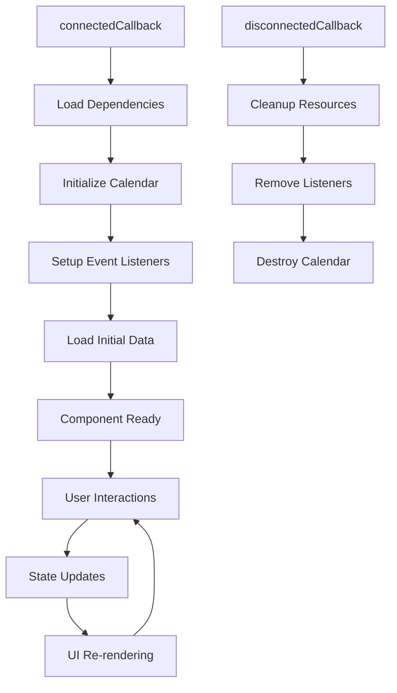

# Technical Details

## Component Overview

The CalendarioReino component is a sophisticated Lightning Web Component that provides comprehensive calendar functionality within the Salesforce ecosystem. This section provides detailed technical information for developers and system administrators.

### Component Structure

```
calendarioReino/
├── calendarioReino.js          (299 KB) - Main controller logic
├── calendarioReino.html        (46 KB)  - Template markup
├── calendarioReino.css         (132 KB) - Component styles
└── calendarioReino.js-meta.xml (0.4 KB) - Metadata configuration
```

## Core Functionality Analysis

### External Library Dependencies

The component relies on several external libraries loaded sequentially:

=== "FullCalendar v3.10.0"

    **Primary calendar engine providing:**
    
    - Multiple view types (month, week, day, agenda)
    - Event rendering and interaction
    - Drag-and-drop functionality
    - Timezone support via Moment.js
    - Localization (Portuguese Brazilian)
    
    **Loading sequence:**
    ```javascript
    1. fullcalendar.min.css
    2. jquery-3.6.0.min.js
    3. jquery-ui.min.js  
    4. moment.min.js
    5. fullcalendar.min.js
    6. pt-br.js (locale)
    ```

=== "Floating UI (@floating-ui/dom)"

    **Dynamic positioning library for:**
    
    - Modal positioning (color picker, appointment editor)
    - Tooltip placement
    - Popup positioning with collision detection
    - Viewport-aware positioning

=== "Supporting Libraries"

    - **jQuery 3.6.0**: Required by FullCalendar v3
    - **Moment.js**: Date/time manipulation and formatting
    - **jQuery UI**: Enhanced UI interactions

### State Management Architecture

#### Reactive Properties

The component uses extensive `@track` properties for reactive UI updates:

```javascript
// Event Data Management
@track events = [];              // Filtered events for display
@track allEvents = [];           // Complete event cache
@track selectedEventId;          // Currently selected event
@track selectedEventData;        // Detailed event information

// UI State Management  
@track isLoading = false;
@track showAppointmentEditor = false;
@track showColorPicker = false;
@track sidebarExpanded = true;

// Filter and Search State
@track searchTerm = '';
@track activeFilter = 'all';
@track selectedUserId;
@track activeColorFilters = [];
@track meetingRooms = [];
```

#### Caching Strategy

!!! success "Two-Tier Caching System"
    
    **Primary Cache (`allEvents`)**
    
    - Stores complete dataset from Salesforce
    - Source of truth for all event data
    - Updated only on server interactions
    
    **Display Cache (`events`)**
    
    - Filtered subset for FullCalendar rendering
    - Updated by client-side filtering
    - Optimizes performance by avoiding server calls

### Event Lifecycle Management

#### Component Lifecycle



#### Dependency Loading

The component implements a robust dependency loading system:

```javascript
async loadDependenciesSequentially() {
    try {
        // 1. Load CSS first
        await this.loadResource(FC_CSS_URL);
        
        // 2. Load JavaScript dependencies in order
        await this.loadResource(JQUERY_URL);
        await this.waitForGlobal('jQuery');
        
        await this.loadResource(JQUERY_UI_URL);
        await this.waitForjQueryPlugin('ui');
        
        await this.loadResource(MOMENT_SCRIPT_URL);
        await this.waitForGlobal('moment');
        
        await this.loadResource(FC_SCRIPT_URL);
        await this.waitForjQueryPlugin('fullCalendar');
        
        await this.loadResource(LOCALE_URL);
        await this.loadResource(FLOATING_UI_SCRIPT_URL);
        
        // 3. Initialize calendar
        await this.initializeCalendarWithRetry();
        
    } catch (error) {
        console.error('Dependency loading failed:', error);
        this.showToast('Error', 'Failed to load calendar dependencies', 'error');
    }
}
```

## Feature Implementation Details

### Interactive Modals

#### Color Picker Modal

**Purpose**: Event color customization and context menu

**Key Features**:

- Dynamic positioning using Floating UI
- Color selection with auto-save
- Meeting link management with validation
- Status and outcome tracking
- Event deletion with confirmation

**Implementation Pattern**:

```javascript
openColorPicker(event, eventElement) {
    // 1. Set selected event context
    this.selectedEventForColorPicker = event;
    
    // 2. Calculate optimal position
    this.calculateColorPickerPosition(eventElement);
    
    // 3. Initialize modal state
    this.initializeColorPickerState(event);
    
    // 4. Show modal
    this.showColorPicker = true;
    
    // 5. Setup event listeners
    this.setupColorPickerListeners();
}
```

#### Compact Appointment Modal

**Purpose**: Quick event creation from day/time selection

**Features**:

- Contextual positioning near clicked element
- Pre-filled date/time from selection
- Meeting type selection (Online, Presencial, Telefônica)
- Auto-generated subject based on inputs
- Streamlined creation workflow

### Sidebar Functionality

#### Teams-Style Layout

The sidebar provides comprehensive calendar management:

=== "Navigation Section"

    - Mini calendar with day selection
    - Month/year navigation
    - Today navigation with highlighting
    - Responsive day grid with current day indicator

=== "User Calendars"

    - Multi-user calendar selection
    - User search and filtering
    - Calendar overlay functionality
    - User photo display with error handling

=== "Meeting Rooms"

    - Real-time availability display
    - Room filtering and selection
    - Occupied time slot visualization
    - Meeting type indicators

=== "Meeting Suggestions"

    - AI-powered scheduling suggestions
    - Conflict detection and resolution
    - Optimal time recommendations
    - Participant availability analysis

=== "Color Legend"

    - Dynamic color categorization
    - Event count by category
    - Interactive filtering
    - Custom color management

### Advanced Filtering System

#### Multi-Criteria Filtering

The component implements sophisticated filtering:

```javascript
applyFilters() {
    let filteredEvents = [...this.allEvents];
    
    // 1. Event Type Filter
    if (!this.isFilterSelected.all) {
        const selectedTypes = this.getSelectedEventTypes();
        filteredEvents = filteredEvents.filter(event => 
            selectedTypes.includes(event.type)
        );
    }
    
    // 2. User Calendar Filter
    if (this.selectedUserId) {
        filteredEvents = this.filterByUser(filteredEvents);
    }
    
    // 3. Color Category Filter
    if (this.activeColorFilters.length > 0) {
        filteredEvents = this.filterByColor(filteredEvents);
    }
    
    // 4. Room Filter
    filteredEvents = this.filterByRoom(filteredEvents);
    
    // 5. Search Term Filter
    if (this.searchTerm) {
        filteredEvents = this.filterBySearchTerm(filteredEvents);
    }
    
    // 6. Update calendar display
    this.updateCalendarEvents(filteredEvents);
}
```

#### Text Normalization

For robust search functionality:

```javascript
normalizeText(text) {
    if (!text) return '';
    return text
        .normalize("NFD")                    // Decompose accented characters
        .replace(/[\u0300-\u036f]/g, "")    // Remove diacritical marks
        .toLowerCase();                      // Convert to lowercase
}
```

## Performance Optimizations

### Event Listener Optimization

```javascript
optimizeEventListeners() {
    const calendarContainer = this.template.querySelector('.calendar-container');
    if (calendarContainer) {
        // Override addEventListener to make scroll events passive
        const originalAddEventListener = calendarContainer.addEventListener;
        calendarContainer.addEventListener = function(type, listener, options) {
            if (['wheel', 'mousewheel', 'touchstart', 'touchmove'].includes(type)) {
                options = { ...options, passive: true };
            }
            return originalAddEventListener.call(this, type, listener, options);
        };
    }
}
```

### Update Strategy

Multi-stage update pattern for optimal user experience:

!!! info "Staged Update Pattern"
    
    **Stage 1 (100ms)**: Immediate cache refresh
    ```javascript
    setTimeout(() => {
        this.calendar.fullCalendar('refetchEvents');
    }, 100);
    ```
    
    **Stage 2 (300ms)**: Auxiliary UI updates
    ```javascript
    setTimeout(() => {
        this.updateColorLegendCounts();
        this.updateRoomAvailability();
    }, 300);
    ```
    
    **Stage 3 (600ms)**: Complete re-rendering
    ```javascript
    setTimeout(() => {
        this.calendar.fullCalendar('rerenderEvents');
        this.calendar.fullCalendar('changeView', currentView.name);
    }, 600);
    ```
    
    **Stage 4 (900ms)**: Dependent modules
    ```javascript
    setTimeout(() => {
        this.forceRefreshMeetingSuggestions();
    }, 900);
    ```

### Memory Management

```javascript
disconnectedCallback() {
    // Clean up event listeners
    this.cleanupOptimizedListeners();
    
    // Destroy FullCalendar instance
    if (this.calendar) {
        this.calendar.fullCalendar('destroy');
        this.calendar = null;
    }
    
    // Clear caches
    this.events = [];
    this.allEvents = [];
    
    // Remove global listeners
    window.removeEventListener('resize', this.handleResize);
}
```

## Integration Patterns

### Apex Controller Communication

```javascript
// Async/await pattern for Apex calls
async saveEventChanges(eventData) {
    try {
        this.isLoading = true;
        const result = await saveEvent({ eventData });
        
        // Update local cache
        this.updateEventInCache(result);
        
        // Trigger UI refresh
        this.refreshCalendarAfterSave();
        
        this.showToast('Success', 'Event saved successfully', 'success');
        
    } catch (error) {
        console.error('Save failed:', error);
        this.showToast('Error', 'Failed to save event', 'error');
    } finally {
        this.isLoading = false;
    }
}
```

### Component Communication

```javascript
// Child component event handling
handleColorUpdate(event) {
    const { eventId, color, category } = event.detail;
    this.updateEventColorInCache(eventId, color, category);
    this.forceCalendarColorRefresh();
}

handleParticipantClick(event) {
    const participantName = event.detail.participantName;
    const participantElement = event.detail.element;
    
    // Show participant details modal
    const modal = this.template.querySelector('c-participant-details-modal');
    modal.showModal(participantName, participantElement);
}
```

---

**Technical Documentation Status**: :material-check-circle:{ .green } Current  
**Code Analysis**: Complete  
**Performance Review**: Quarterly  
**Maintainer**: Development Team
